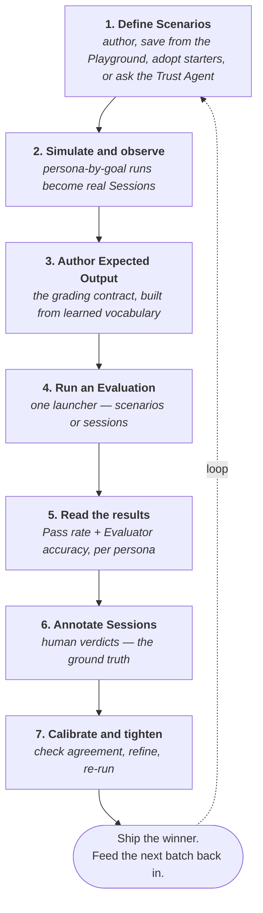

The Trust AI workflow is a **loop, not a line**. Each step feeds the next; the output of the final step closes back to the start. Every concept page in this section is one verb in this loop. Read this page to see how they connect.

## In one paragraph

You **define Scenarios** — persona-plus-goal test cases you author yourself, save from a Playground chat, adopt from the recommended starters, or ask the Trust Agent to draft. You **run them**: each persona simulates a conversation against your connected agent, and every simulated conversation lands as a real **Session** next to the ones synced from your runtime. You read those sessions and **author each scenario's Expected Output** — the grading contract — picking actions, routes, and judge criteria from vocabulary Trust AI learned from real sessions. You **run an Evaluation** from one unified launcher, against scenarios (live simulation) or against sessions that already happened (judge-only grading), scoped to a specific **Agent Version**. Results lead with a dual headline: **Pass rate** grades the agent, **Evaluator accuracy** grades the judges. You **annotate sessions** with human verdicts — the ground truth the judges are measured against — then **calibrate** each judge until it agrees with your reviewers. Then you tighten the scenarios, re-run, and the loop continues.

## The diagram

The loop is not strictly linear — you can evaluate sessions before authoring any Expected Output, or calibrate a judge before writing your own scenarios. The arrows show the **dependency direction**, not a forced sequence. Annotation is never a prerequisite: an evaluation can start the moment you have scenarios or sessions to grade.

## The seven steps in depth

### 1. Define Scenarios

A **Scenario** is a first-class test case: a name, a goal, the personas that will pursue it, and (eventually) an Expected Output that defines what passing looks like. Every scenario carries a stable id like `SCN-000123`, and your project keeps them in one flat, searchable **Scenarios** list.

Four ways to get scenarios, cheapest first:

- **Adopt starters.** Click **Add recommended scenarios** to adopt curated safety scenarios mapped to the OWASP Agentic AI Top 10 — coverage before you've written a word.
- **Ask the Trust Agent.** Describe what your agent should and shouldn't do; the Trust Agent drafts behavior and security scenarios for you.
- **Save from the Playground.** Had a conversation worth keeping? **Save as a scenario** turns it into a scenario with the conversation already attached as its first session.
- **Author by hand.** Name, goal, personas. Expected output is deliberately deferred — you'll set it later, usually from a session you like.

Defining scenarios is deliberately cheap. The product's opinion: write the test case first, let real runs teach you what "correct" looks like.

**Read more:** [Scenarios](/concepts/scenarios) · [Simulate with scenarios](/how-to/simulate-with-scenarios)

### 2. Simulate and observe

Run a scenario and Trust AI simulates it against your connected agent — one conversation per persona per goal. Each simulated conversation is persisted as a real **Session**, linked back to its scenario, sitting alongside the sessions synced from your runtime. Nothing about a generated session is second-class: same transcript view, same annotations, same evaluations.

Sessions arrive from three directions, and each one wears a **Source** chip telling you which: **Scenario** (simulated from a scenario run or evaluation), **Playground** (an unsaved Playground conversation), or **External** (synced from your connected runtime). Trust AI connects to **Salesforce Agentforce**, **AWS Bedrock Agents**, **AWS Bedrock AgentCore**, and **Claude Managed Agent** runtimes; syncing is read-only — Trust AI never modifies the source runtime.

The Scenarios list has a **Run** split button: **Run & evaluate** to simulate and grade in one move, or **Run only** to simulate without grading — useful when you're still learning how the agent behaves. Bulk runs keep you on the list with live per-scenario progress badges.

**Read more:** [Sessions](/concepts/sessions) · [Connect an AWS Bedrock AgentCore agent](/how-to/connect-agentcore)

### 3. Author the Expected Output

The **Expected Output** is a scenario's grading contract — the keystone of the loop. Open a scenario's fly-in, and the **Expected Output** tab gives you three sections:

- **Expected behavior** — LLM-judge evaluator cards, with the presets that fit this scenario surfaced first under **Recommended for this scenario**.
- **Expected actions** — the tool calls the agent must (or must not) make, with parameter checks.
- **Expected routes** — where the conversation should be routed.

You don't type these from memory. The options come from vocabulary Trust AI **learned from your real sessions** — the actions and routes your agent actually uses. That's why this step comes after simulation: run the scenario, open a session where the agent did the right thing, and encode what you saw as the contract.

**Read more:** [Scenarios](/concepts/scenarios) · [Evaluators](/concepts/evaluators)

### 4. Run an Evaluation

Every run starts from one place: the **Evaluation Launcher**, opened from **+ New evaluation** on the Evaluations list, from **Run & evaluate** on scenarios, or from **Evaluate** on sessions. The launcher shows a fan-out preview of exactly what will run, and it grades two kinds of source:

- **Scenarios** — live simulation: each persona enacts its goal against the Agent Version you picked, and the judges plus the scenario's Expected Output grade the result.
- **Sessions** — grade the conversations that **already happened**. The judges read each captured session and score it; nothing is re-sent to your agent, and the session is never modified.

A run whose test cases were attempted more than once leads with a **Pass^K** reliability headline, because an agent that passes once isn't an agent that passes reliably. (At this release the launcher runs each case once; Pass^K renders on repeated-trial runs where they exist.) For quick checks there's also one-off grading: **Evaluate in place** scores a single scenario or session where it lives, with no run added to the Evaluations list.

Each run records the version of your scenario data at launch, so editing a scenario later never rewrites historical results.

**Read more:** [Evaluations](/concepts/evaluations) · [Run your first Evaluation](/tutorials/run-first-evaluation)

### 5. Read the results

Run detail leads with a **dual headline**:

- **Pass rate** — how often the agent met the bar. This grades **the agent**.
- **Evaluator accuracy** — how often the automated judges agreed with a human's verdict on the same sessions. This grades **the judges**.

The split matters. A pass rate is only as trustworthy as the judges producing it, so Trust AI shows you both numbers side by side.

Below the headline, a per-persona matrix scores **every attached persona on its own**, with plain-English divergence hints when personas disagree — the friendly persona passing while the frustrated one fails is exactly the signal you ran multiple personas to find. Results are honest about what isn't the agent's fault: a guardrail-blocked response shows as **Guardrail blocked**, and infrastructure hiccups show as **Environment problem — not the agent**, excluded from the score rather than painted as a red fail. Any result's **Open session** button lands you on the exact session it graded.

**Read more:** [Evaluations](/concepts/evaluations)

### 6. Annotate Sessions

Human judgment enters the loop on the Sessions surface. Every project starts with a **Verdict** (pass/fail) column, a **Severity** column, and a **Reviewer note** column, and you can add your own typed annotation columns — score, category, tags, comment. Set verdicts inline in the table, or in a session fly-in's **Annotations** tab while reading the transcript.

Two verdicts, two jobs: the **automated verdict** (Pass / Fail / Not evaluated) comes from the judges; your **human Verdict** is the ground truth those judges are graded against. A human verdict never overrides the automated one — it measures it. Every verdict you record sharpens the Evaluator accuracy headline on the next run.

**Read more:** [Annotations](/concepts/annotations) · [Sessions](/concepts/sessions)

### 7. Calibrate and tighten

An **Evaluator** is a reusable judge — plain-language **Passes when… / Fails when…** rules, no prompt engineering required. Start from the recommended evaluators (a curated Trust Library spanning quality and safety checks), tailor them to your agent, or draft rules with **Tailor with AI**.

Then make the judge earn your trust. An LLM-judge evaluator's **Calibrate** tab runs the exact production judge against sessions you've already given human verdicts and reports a plain-language agreement score, with disagreements listed first. Work the disagreements: refine a rule, re-check agreement, watch the calibration history climb. Judge verdicts are deterministic — the same transcript always gets the same verdict — so improvement you measure is improvement you keep.

Tightening feeds every earlier step: a judge that over-rejects gets a sharper rule, a scenario that no longer reflects reality gets edited or safely deleted, a gap in coverage gets a new scenario. Then you re-run — **Re-run** on any finished run restores its full configuration.

**Read more:** [Evaluators](/concepts/evaluators) · [Write an effective LLM-judge prompt](/how-to/write-llm-judge-prompt)

## The Trust Agent can drive the loop

You don't have to click through the loop by hand — the **Trust Agent** can run it conversationally. For a brand-new project it guides the whole cold start inside one conversation: connect your agent, run an observe-only exploration that watches how it behaves without scoring it, draft behavior and security scenarios (it proposes adversarial coverage on its own), and launch your first scored evaluation. On an established project, asking it to draft scenarios, adjust coverage, or kick off a run is usually faster than the UI.

**Read more:** [The Trust Agent](/concepts/trust-agent) · [Work with the Trust Agent](/how-to/work-with-the-trust-agent)

## Where this fits in your team's workflow

Different roles touch different parts of the loop:

<CardGroup cols={3}>
  <Card title="SI Consultant" icon="user-cog">
    **Touches all seven steps** during a customer engagement. Sets up the Project, connects the runtime, adopts the recommended evaluators and scenarios, leads the first simulation-and-annotation wave, runs the first Evaluations, then hands recurring operations to the customer team.
  </Card>
  <Card title="QA Practitioner" icon="clipboard-check">
    **Lives in steps 3, 6, and 7** — authoring Expected Output from real sessions, recording human verdicts, and calibrating judges. Their judgment is the ground truth every automated verdict is measured against.
  </Card>
  <Card title="Agent Owner" icon="user-shield">
    **Lives in steps 4 and 5** — running Evaluations on candidate Agent Versions, reading the dual-headline results, making ship / don't-ship decisions. Touches the loop weekly or per-release, not daily.
  </Card>
</CardGroup>

The personas overlap on real teams. A solo founder might play all three. A larger customer may have dozens of QA Practitioners, a few Agent Owners, and one SI Consultant who set the whole thing up.

## What to do with the results

The output of a run is rarely a single number. Three common outcomes:

- **Ship the candidate.** Pass rate cleared your bar, Evaluator accuracy says the judges are trustworthy, and the reliability headline holds up across repeated trials. To compare **Agent Versions**, run the same scenarios and evaluators against each version and read the two run details side by side — there is no dedicated side-by-side comparison view in the product today.
- **Investigate a failure.** A persona or a category of scenarios failed. Open the failing results, read the judges' reasoning, jump to the graded conversation with **Open session**, and decide: did the agent regress, is the judge over-rejecting, or is the scenario stale? Each answer re-enters the loop at a different step.
- **Refine the judge.** The judge and your reviewers disagree. Record human verdicts on the disputed sessions, open the evaluator's **Calibrate** tab, work the disagreements-first list, and re-run. The judge gets better; the next signal is sharper.

In all three, the next batch of sessions — synced from production or simulated from scenarios — feeds the loop again: new conversations become new verdicts, new verdicts calibrate the judges, calibrated judges make the next run's headline worth trusting.

## Related reading

- **[Projects](/concepts/projects)** — the workspace boundary every loop runs inside
- **[Scenarios](/concepts/scenarios)** — step 1 test cases and step 3 grading contracts
- **[Sessions](/concepts/sessions)** — step 2 conversations, simulated and synced
- **[Playground](/concepts/playground)** — chat with your agent and save the keepers as scenarios
- **[Evaluators](/concepts/evaluators)** — step 7 judgment functions
- **[Evaluations](/concepts/evaluations)** — steps 4 and 5, scored runs
- **[Annotations](/concepts/annotations)** — step 6 human signal
- **[Agent Versions](/concepts/agent-versions)** — the thing every run is scoped to
- **[Glossary](/glossary)** — every term, defined once, sortable
