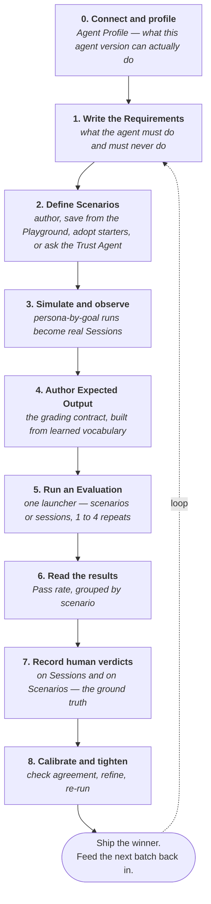

The TrustAI workflow is a **loop, not a line**. Each step feeds the next; the output of the final step closes back to the start. Every concept page in this section is one verb in this loop. Read this page to see how they connect.

## In one paragraph

You **write the Requirements** — what your agent must do and must never do, in the language your business uses. You **define Scenarios** — persona-plus-goal test cases you author yourself, save from a Playground chat, adopt from the recommended starters, or ask the Trust Agent to draft. You **run them**: each persona simulates a conversation against your connected agent, and every simulated conversation lands as a real **Session** next to the ones synced from your runtime. You read those sessions and **author each scenario's Expected Output** — the grading contract — picking actions, routes, judge criteria, and reference material from vocabulary TrustAI learned from real sessions. You **run an Evaluation** from one unified launcher, against scenarios (live simulation) or against sessions that already happened (replayed to the connected agent, and the new answers graded), scoped to a specific **Agent Version**, repeating each test case up to four times if you want a reliability read. Results group **by scenario** and lead with **Pass rate**, joined by **Evaluator accuracy** once human verdicts exist to grade the judges against. You **record verdicts** — the ground truth the judges are measured against — then **calibrate** each judge until it agrees with your reviewers. Then you tighten the scenarios, re-run, and the loop continues.

## The diagram

```mermaid
flowchart TD
    P["<b>0. Connect and profile</b><br/><i>Agent Profile — what this agent version can actually do</i>"]
    S1["<b>1. Write the Requirements</b><br/><i>what the agent must do and must never do</i>"]
    S2["<b>2. Define Scenarios</b><br/><i>author, save from the Playground, adopt starters, or ask the Trust Agent</i>"]
    S3["<b>3. Simulate and observe</b><br/><i>persona-by-goal runs become real Sessions</i>"]
    S4["<b>4. Author Expected Output</b><br/><i>the grading contract, built from learned vocabulary</i>"]
    S5["<b>5. Run an Evaluation</b><br/><i>one launcher — scenarios or sessions, 1 to 4 repeats</i>"]
    S6["<b>6. Read the results</b><br/><i>Pass rate, grouped by scenario</i>"]
    S7["<b>7. Record human verdicts</b><br/><i>on Sessions and on Scenarios — the ground truth</i>"]
    S8["<b>8. Calibrate and tighten</b><br/><i>check agreement, refine, re-run</i>"]
    SHIP(["Ship the winner.<br/>Feed the next batch back in."])

    P --> S1
    S1 --> S2
    S2 --> S3
    S3 --> S4
    S4 --> S5
    S5 --> S6
    S6 --> S7
    S7 --> S8
    S8 --> SHIP
    SHIP -.->|loop| S1
```

The loop is not strictly linear — you can evaluate sessions before authoring any Expected Output, or calibrate a judge before writing your own scenarios. The arrows show the **dependency direction**, not a forced sequence. Recording verdicts is never a prerequisite: an evaluation can start the moment you have scenarios or sessions to grade.

One arrow is not optional, though. If you drive the loop through the [Trust Agent](/concepts/trust-agent), **requirements really do come before scenarios**: ask it to generate scenarios with no requirement saved and it refuses outright — *"Draft and save the requirements first. I can guide you through that now before we continue."* Everything downstream chains off that gate.

## Before the loop: connect and profile

Every loop runs against a **connection**. TrustAI connects to four agent platforms, each with its own setup flow: **AWS Bedrock AgentCore**, **Salesforce Agentforce**, **Claude Managed Agent**, and the **Conversational HTTP agent** (any agent that accepts AG-UI run requests and streams AG-UI events over SSE). Syncing is read-only — TrustAI never modifies the source runtime.

Once an agent is connected its **Agent Profile** is captured for you, in the background: a structured read of what a specific **Agent Version** can actually do — its topics, tools, routes, and guardrails — so you write scenarios against the real surface instead of guessing at it. Keep the two nouns apart: an **Agent Version** is the pinned snapshot under test; an **Agent Profile** is a description *of* that version, and its versioned unit is the **profile revision**.

- The profile card carries a lifecycle pill — **Profile queued**, **Profile in progress**, **Profile available**, **Profile failed**, or **Profile out of date** — plus a never-generated empty state with a **Generate profile** button.
- Coverage reads **Captured**, **Partial**, or **Limited** — never a percentage.
- Each source reads **Available**, **Not exposed**, **Not sampled**, or **Not run**. Only the first is a presence; the other three are three different *absences*, and the profile keeps them apart rather than flattening them into "unavailable".
- A profile revision goes through review: **Pending review**, then **Approved** or **Changes requested** via the **Approve** and **Request changes** actions.
- Capability discovery is implemented for **Conversational HTTP**, **Claude Managed Agent**, and **Salesforce Agentforce**. On an AgentCore connection the profile surface reads "Agent profiling isn't available for this connection yet."

Two different pins hang off this: an **Evaluation** pins an *agent version*, while a **Trust Agent session** pins a *profile revision*.

**Read more:** [Agent Profile](/concepts/agent-profile) · [Agent Versions](/concepts/agent-versions) · [Connect an AWS Bedrock AgentCore agent](/how-to/connect-agentcore)

## The eight steps in depth

### 1. Write the Requirements

A **Requirement** is a statement about your agent in the language your business uses: *"Refund requests are resolved within one conversation."* *"Never promise a refund amount without checking policy."* It is the layer above the test case — the thing a test case exists to prove — and it is what makes a coverage gap visible instead of invisible.

Each requirement carries a bare, unpadded handle — `REQ-1`, `REQ-2` — a lifecycle (draft, active, archived) and a computed health rollup: **Passing**, **Failing**, **Partially covered**, **Uncovered**, or **Not yet run**. The saved-view chips are **All**, **Gaps** and **Failing**; **Gaps** is everything uncovered or only partly covered, which is the list to work down.

Write them by hand, import them, pull them out of a document, or ask the Trust Agent for a first draft from what your agent already does. Whichever route you take, this step comes first: the Trust Agent's authoring workflow refuses to generate scenarios until a requirement is saved, and every later step — expected output, test data, simulating, running — stays closed until each requirement has an evaluator created *and* attached.

**Read more:** [Requirements](/concepts/requirements) · [Capture requirements](/how-to/capture-requirements)

### 2. Define Scenarios

A **Scenario** is a first-class test case: a name, a goal, the personas that will pursue it, and (eventually) an Expected Output that defines what passing looks like. Every scenario carries a stable id like `SCN-000123`, and your project keeps them in one flat, searchable **Scenarios** list.

Four ways to get scenarios, cheapest first:

- **Adopt starters.** Click **Add recommended scenarios** to adopt curated safety scenarios mapped to the OWASP Agentic Top 10 (2026) — coverage before you've written a word.
- **Ask the Trust Agent.** Describe what your agent should and shouldn't do; the Trust Agent drafts behavior and security scenarios for you.
- **Save from the Playground.** Had a conversation worth keeping? **Save as a scenario** turns it into a scenario with the conversation already attached as its first session.
- **Author by hand.** Name, goal, personas. Expected output is deliberately deferred — you'll set it later, usually from a session you like.

Defining scenarios is deliberately cheap. The product's opinion: write the test case first, let real runs teach you what "correct" looks like.

**Read more:** [Scenarios](/concepts/scenarios) · [Simulate agents with scenarios](/how-to/simulate-with-scenarios)

### 3. Simulate and observe

Run a scenario and TrustAI simulates it against your connected agent — one conversation per persona per goal. Each simulated conversation is persisted as a real **Session**, linked back to its scenario, sitting alongside the sessions synced from your runtime. Nothing about a generated session is second-class: same transcript view, same annotations, same evaluations.

Sessions arrive from three directions, and the **Source** column tells you which: **Scenario** (simulated from a scenario run or evaluation), **Playground** (an interactive capture finalized without a scenario link), or **External** (synced from your connected runtime). A conversation you save in the [Playground](/concepts/playground) reads **Scenario**, because saving there always attaches one. Source is hidden by default — show it from the column menu when the mix matters.

The Scenarios list has a **Run** split button: **Run & evaluate** to simulate and grade in one move, or **Run only** to simulate without grading — useful when you're still learning how the agent behaves. Bulk runs keep you on the list with live per-scenario progress badges.

**Read more:** [Sessions](/concepts/sessions) · [Playground](/concepts/playground)

### 4. Author the Expected Output

The **Expected Output** is a scenario's grading contract — the keystone of the loop. Open a scenario's fly-in, and the **Expected Output** tab gives you:

- **Expected behavior** — LLM judge evaluator cards, with the presets that fit this scenario surfaced first under **Recommended for this scenario**. **Reference material** nests here: attach the source documents a **Groundedness judge** grades the agent's claims against.
- **Expected actions** — the tool calls the agent must (or must not) make, with parameter checks. Assertions are **required** or **disallowed**; there is no third setting.
- **Expected routes** — where the conversation should be routed.

Structural checks live here on Expected Output, not on a standalone evaluator.

You don't type these from memory. The options come from vocabulary TrustAI **learned from your real sessions** — the actions and routes your agent actually uses. That's why this step comes after simulation: run the scenario, open a session where the agent did the right thing, and encode what you saw as the contract.

Reference material is attached **per scenario**, never on the evaluator — the same Groundedness judge grades different scenarios against different documents.

**Read more:** [Scenarios](/concepts/scenarios) · [Evaluators](/concepts/evaluators)

### 5. Run an Evaluation

Every run starts from one place: the **Evaluation Launcher**. It opens wherever a run can begin — **New evaluation** on the Evaluations list, **Run & evaluate** on scenarios, **Evaluate** on sessions, and the rest of the set in [Launching a run](/concepts/evaluations#launching-a-run). The launcher shows a fan-out preview of exactly what will run under **This will run**, and it grades two kinds of source:

- **Scenarios** — live simulation: each persona enacts its goal against the Agent Version you picked, and the judges plus the scenario's Expected Output grade the result.
- **Sessions** — grade the conversations that **already happened**, by replaying them: each session's stored user message goes back to your connected agent and the reply it gives *now* is graded. The stored session is never modified.

A scenarios launch carries one section a sessions launch doesn't: **Environment**, below the fan-out preview. It names the connected org or test data store, test identity and cleanup the run will use, preselects the environment attached to the agent you chose, and probes it — the run button waits until that probe reads **Ready to run**. A sessions launch shows no Environment section at all, though it still needs a connected agent to replay against. See [Test data](/concepts/test-data) for what the choice changes.

**Repeat each test case** is a `1 | 2 | 3 | 4` picker on the launcher. Leave it at 1 for a single attempt; raise it and every case is replicated that many times, because an agent that passes once isn't an agent that passes reliably. The picker shows on any graded run-minting launch — both sources — and is hidden on the two launches that have nothing to repeat: a quick evaluation (which mints no run) and a **Run only** simulation (which produces no pass/fail signal). A repeated run leads with a **Pass^K** reliability headline.

For quick checks there's also the **quick evaluation**: **Evaluate** on a single session scores it where it lives. It still mints no run, but it is no longer invisible — the session's **Evaluations** tab counts the checks off (*"Scoring check 2 of 3…"*) while they run, and when it finishes the Evaluations page carries a row named **Quick evaluation** with a muted **Quick** pill. Clicking that row opens the conversation it graded rather than a run-detail page, and because there is no run behind it the row offers no **Cancel** and no **Delete run**. Grade the same session again and the new verdict replaces the old one.

**A launch is not unconditional — the launcher can refuse it.** Two refusals you'll meet in normal use:

- **Reference material required.** A targeted scenario binds a Groundedness judge but has no documents attached. The launcher names the blocking scenarios and disables the run button until you attach reference material on each scenario's Expected Output tab.
- **Credit limit reached.** A run whose estimated cost is over your workspace's credit pool is refused at admission, and the launcher pins a persistent banner titled **Credit limit reached** whose body reads "cap reached — contact your admin". The modal stays open so you can see it. The credit pool resets monthly; raising it is a workspace admin action.

Editing a scenario after a run never rewrites that run's history — but the mechanism is per result, not a version stamp on the run. Each result stores a **frozen snapshot** of the scenario's input and expected output, plus a snapshot of the persona's defining attributes, taken at the moment it was evaluated. The run separately pins the exact **evaluator versions** it graded with. Edit a scenario, rename a persona, or revise an evaluator afterwards and the finished run still reads exactly as it was scored.

**Read more:** [Evaluations](/concepts/evaluations) · [Run your first Evaluation](/tutorials/run-first-evaluation)

### 6. Read the results

Run detail leads with **Pass rate** — how often the agent met the bar. This grades **the agent**.

Beside it, once there is anything to compute it from, sits **Evaluator accuracy** — how often the automated judges' combined verdict agreed with a human's verdict on the same cases. This grades **the judges**. It reads each case that carries a human verdict, combines that case's **LLM judge** scores into one pass-or-fail (any judge fail means fail), and counts the matches. Only LLM judges are compared — structural and outcome-grounded scores are excluded, so a case graded solely by those can't move the number. Cases with no human verdict can't contribute and are excluded — so on a run with no human verdicts yet, the accuracy headline **isn't shown at all** rather than displaying a misleading zero. A run with no behavioral grade at all says which kind of ungraded it is in the headline slot: **Run only — nothing was graded** for a deliberate simulation, **Not graded — no evaluators** for a graded run that inherited none, and a bare **Not graded** for anything else.

The split matters. A pass rate is only as trustworthy as the judges producing it.

**Results group by scenario.** The default view is **By scenario**: one summary row per scenario, expandable to its individual attempts as **Trial 1**, **Trial 2**, and so on. The summary row carries the scenario's reliability as a fraction — `2/3` means two of three graded attempts passed. The fly-in switcher reads **Trial N of K**. The explicit **Flat** view, in the column menu, drops the grouping and gives you one row per attempt. Persona is a label on the row, not a separate axis: a failing row also carries a plain-English divergence hint describing how the agent's behavior differed from what the scenario expected.

Results are honest about what did and didn't count, on two separate axes. **Five outcomes are excluded from the pass-rate denominator — never counted as a red Fail, never fabricated into a Pass — and only four of them are the environment's fault.** Exclusion says the result left the score; attribution says whose problem it was. They surface under four labels:

| Reads as | What happened, and whose problem it is |
| --- | --- |
| **Guardrail blocked** | A runtime guardrail suppressed the agent's response. **The environment.** |
| **Environment problem** | The supporting infrastructure failed, or the harness was misconfigured for that case. **The environment.** |
| **Access blocked** | The platform authenticated the test user but denied it access to the agent. **The environment.** |
| **Couldn't test** | An action the agent itself runs returned an error, so the behavior under test never happened. **The agent's own stack.** |

The first three labels — four outcomes, because **Environment problem** covers two — are the ones the product frames as *not the agent's fault*, and they read as a neutral **Not graded** cell rather than a verdict. **Couldn't test does not join them.** It paints its own amber chip in the **Final verdict** column, and its banner says only what happened — *"Not scored because an action the agent runs returned an error."* — because the failing action belongs to the agent, not to the rig. A summary row over mixed trials reads **Pass among scored** with an **N couldn't test** caption rather than a bare pass.

Keep **Not graded** distinct from **Not evaluated**, which means no evaluation exists for the session at all. Evidence-but-no-behavioral-score is **Not graded**; nothing-happened-yet is **Not evaluated**.

Two more reliability words belong to these screens and nowhere else: **Not scored**, what the product says about a conversation an action failure made ungradeable, and **Unverified**, a conversation whose trace evidence is pending or never arrived — which **stays in the run** and is not treated as an action failure. Where a run couldn't test anything, Run Detail carries an amber **Couldn't test some conversations** strip with a **See details** action, and the Evaluations list prints an amber **N couldn't test** beside that run's pass rate so a green rate never renders uncaveated.

A per-check verdict has a third state too: **Needs review** (amber), which is excluded from pass/fail gating — it never flips the row's **Final verdict** and never overrides a sibling evaluator's result. Any result's **Open session** button lands you on the exact session it graded.

**Read more:** [Evaluations](/concepts/evaluations) · [Saved views](/concepts/saved-views)

### 7. Record human verdicts

Human judgment enters the loop on **two** surfaces, and they do different jobs.

**On Sessions** — every project starts with a **Verdict** (pass/fail) column, a **Severity** column, and a **Reviewer note** column, and you can add your own typed annotation columns: score, category, tags, comment. Set verdicts inline in the table, or in a session fly-in's **Annotations** tab while reading the transcript. These session-level Verdict annotations are what grounds **Evaluator accuracy** on runs.

**On Scenarios** — the Scenarios list carries its own **Verdict** column, writable straight from the flat list without opening anything. These pass/fail marks on scenarios are what the evaluator **Calibrate** tab samples when it checks agreement.

Two verdicts, two jobs: the **automated verdict** comes from the judges; your **human Verdict** is the ground truth those judges are graded against. **On the session Verdict annotation column a human verdict never overrides the automated one — it measures it.** That rule is scoped to that column, not universal: on a Groundedness result a reviewer *can* override a per-claim verdict, and the score recomputes (see step 8). Every verdict you record sharpens the Evaluator accuracy headline on the next run.

**Read more:** [Annotations](/concepts/annotations) · [Annotate sessions](/how-to/annotate-sessions)

### 8. Calibrate and tighten

An **Evaluator** is a reusable judge — plain-language **Passes when… / Fails when…** rules, no prompt engineering required. Start from the recommended evaluators (a curated catalog spanning quality and safety checks), tailor them to your agent, or draft rules with **Tailor with AI**. A rubric is **grading criteria only**: response-format, verdict-shape, and answer-key sections are rejected when you save.

Then make the judge earn your trust. An LLM judge's **Calibrate** tab runs the exact production judge against scenarios you've already marked pass or fail — its **Check agreement** section samples up to 20 of them — and reports a plain-language agreement score with disagreements listed first. Work the disagreements: refine a rule, hit **Re-calibrate**, watch the agreement climb.

**How far determinism goes.** An **LLM judge** runs at temperature 0 — greedy decoding — so the same transcript gets the same verdict, and improvement you measure is improvement you keep. That property is real, and it's why calibration means anything.

It does **not** extend to the whole judge family. A **Groundedness judge** decomposes each answer into atomic claims and classifies every claim against the attached reference material as **Supported**, **Contradicted**, **Unsupported**, **Unknown**, or **Conversational**; the metric chip reads **N% grounded**. The model call is temperature 0 and everything downstream of it is a fixed parser and a fixed battery of guards — but the result is still open to a **human**. In the groundedness report a reviewer can override any single claim's verdict, with a note, and the score recomputes on the spot; **revert** puts the judge's verdict back. So the same transcript can carry a different final score after adjudication, by design. Any uncertainty — a truncated response, a fired guard, an `Unknown` claim — collapses to **Needs review** rather than a fabricated pass or fail.

Tightening feeds every earlier step: a judge that over-rejects gets a sharper rule, a scenario that no longer reflects reality gets edited or safely deleted, a gap in coverage gets a new scenario. Then you re-run — **Re-run** on any finished run reopens the launcher pre-filled with that run's scenarios or sessions, its evaluators, and its Agent Version, all still editable. One field it does **not** carry over: **Repeat each test case** resets to 1, so a re-run of a repeated run is a single-attempt run unless you raise the picker again. Set it back before you launch if you want the reliability read.

**Read more:** [Evaluators](/concepts/evaluators) · [Calibrate an evaluator](/how-to/calibrate-an-evaluator) · [Write grading rules and judge prompts](/how-to/write-llm-judge-prompt)

## The Trust Agent can drive the loop

You don't have to click through the loop by hand — the **Trust Agent** can run it conversationally, in one of three modes: **Ask**, **Plan**, or **Act**. For a brand-new project it guides the whole cold start inside one conversation: connect your agent, run an observe-only exploration that watches how it behaves without scoring it, draft behavior and security scenarios (it proposes adversarial coverage on its own), and launch your first scored evaluation. On an established project, asking it to draft scenarios, adjust coverage, or kick off a run is usually faster than the UI.

**You stay in the loop on every write.** Whatever mode you're in, the runtime pauses and asks before it creates, edits, or deletes anything — a scenario, an evaluator, a run. You approve or decline each proposal. For work you do repeatedly, a **standing approval** grants one kind of action for the rest of the chat; the chip on the composer shows what's granted and until when, and **turn off** ends it.

The prototype below shows the shape of one of those pauses — a clarifying-question card that takes the place of the composer until you answer.

<Frame caption="Interactive prototype — the Trust Agent's multi-question clarification card. Design reference.">
  <iframe src="https://provar-trustai.github.io/docs/qa-flow.html" width="100%" height="660" style={{border:0}}
          loading="lazy" allow="fullscreen" title="Multi-question clarification prototype" />
</Frame>

The prose above, not the prototype, is the authority on shipped behavior — the embed's question copy is illustrative.

**Read more:** [The Trust Agent](/concepts/trust-agent) · [Approve an agent write](/how-to/approve-agent-writes) · [Work with the Trust Agent](/how-to/work-with-the-trust-agent)

## Where this fits in your team's workflow

Different roles touch different parts of the loop:

<CardGroup cols={3}>
  <Card title="SI Consultant" icon="user-cog">
    **Touches all eight steps** during a customer engagement. Sets up the Project, connects the runtime, adopts the recommended evaluators and scenarios, leads the first simulation-and-review wave, runs the first Evaluations, then hands recurring operations to the customer team.
  </Card>
  <Card title="QA Practitioner" icon="clipboard-check">
    **Lives in steps 4, 7, and 8** — authoring Expected Output from real sessions, recording human verdicts on sessions and scenarios, and calibrating judges. Their judgment is the ground truth every automated verdict is measured against.
  </Card>
  <Card title="Agent Owner" icon="user-shield">
    **Lives in steps 5 and 6** — running Evaluations on candidate Agent Versions, reading the results, making ship / don't-ship decisions. Touches the loop weekly or per-release, not daily.
  </Card>
</CardGroup>

The personas overlap on real teams. A solo founder might play all three. A larger customer may have dozens of QA Practitioners, a few Agent Owners, and one SI Consultant who set the whole thing up.

## What to do with the results

The output of a run is rarely a single number. Three common outcomes:

- **Ship the candidate.** Pass rate cleared your bar, Evaluator accuracy says the judges are trustworthy, and the reliability fractions hold up across repeats. To compare **Agent Versions**, run the same scenarios and evaluators against each version and read the two run details side by side — there is no dedicated comparison view in the product today.
- **Investigate a failure.** A scenario or a category of scenarios failed. Open the failing results, read the judges' reasoning and the divergence hint, jump to the graded conversation with **Open session**, and decide: did the agent regress, is the judge over-rejecting, or is the scenario stale? Each answer re-enters the loop at a different step.
- **Refine the judge.** The judge and your reviewers disagree. Record human verdicts on the disputed cases, open the evaluator's **Calibrate** tab, work the disagreements-first list, and re-run. The judge gets better; the next signal is sharper.

In all three, the next batch of sessions — synced from production or simulated from scenarios — feeds the loop again: new conversations become new verdicts, new verdicts calibrate the judges, calibrated judges make the next run's headline worth trusting.

## Related reading

- **[Projects](/concepts/projects)** — the workspace boundary every loop runs inside
- **[Requirements](/concepts/requirements)** — step 1, the rules every test case exists to prove
- **[Scenarios](/concepts/scenarios)** — step 2 test cases and step 4 grading contracts
- **[Sessions](/concepts/sessions)** — step 3 conversations, simulated and synced
- **[Playground](/concepts/playground)** — chat with your agent and save the keepers as scenarios
- **[Evaluators](/concepts/evaluators)** — step 8 judgment functions
- **[Evaluations](/concepts/evaluations)** — steps 5 and 6, scored runs
- **[Annotations](/concepts/annotations)** — step 7 human signal
- **[Agent Versions](/concepts/agent-versions)** — the thing every run is scoped to
- **[Glossary](/glossary)** — every term, defined once, sortable
