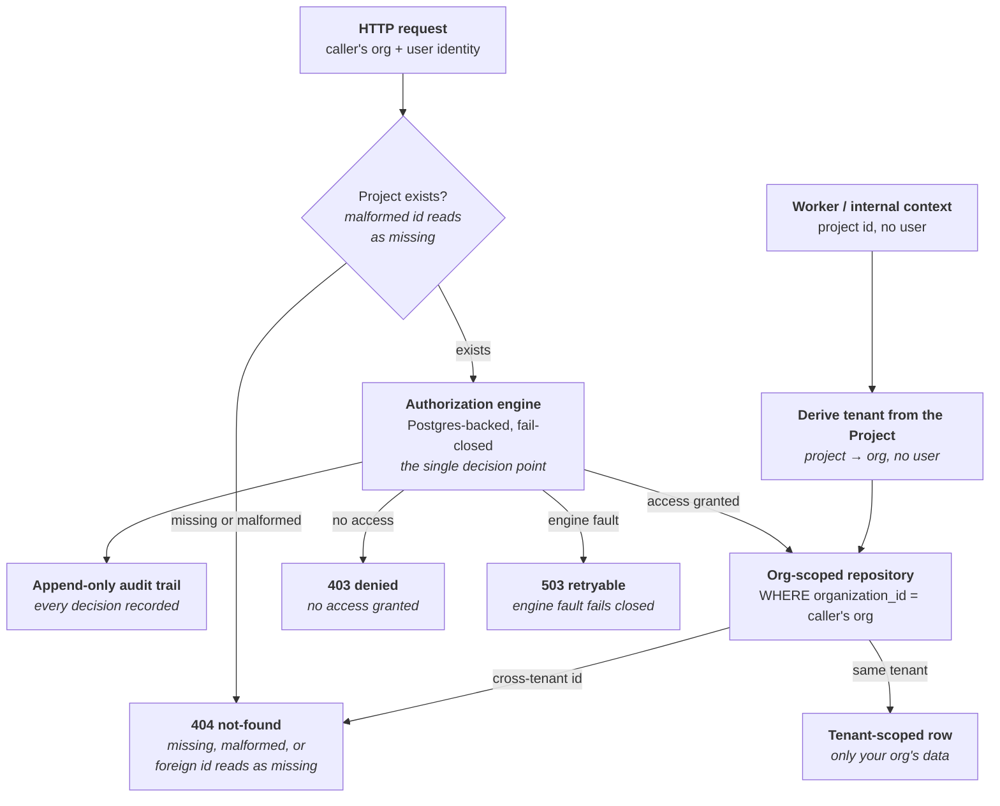

A **[Project](/concepts/projects)** is the workspace boundary you see in the product. **Multi-tenancy** is the boundary the platform enforces *beneath* it: the guarantee that your data never crosses into another customer's tenant, and theirs never crosses into yours.

This page is a security and data-model concept, not a workflow. The claims here are architectural — properties of the schema, the authorization engine, and the repository layer — rather than buttons you click. They were checked against the application source at the shipped release. Where a claim rests on code inspection rather than observed behavior, the page says so.

## The organization is the tenant boundary

In Trust AI, an **organization** is the tenant. An organization owns many Projects, and every Project — together with all of its **[Sessions](/concepts/sessions)**, **[Scenarios](/concepts/scenarios)**, **[Personas](/concepts/scenarios)**, **[Evaluators](/concepts/evaluators)**, **[Evaluations](/concepts/evaluations)**, simulations, and **[Trust Agent](/concepts/trust-agent)** tasks — belongs to exactly one organization. Identity, and the organization itself, are federated through **WorkOS SSO**: your company's single sign-on is the source of truth for who you are and which tenant you belong to.
{/* ACCURACY-AUDIT-PENDING: an organization owns many Projects and every Project + its artifacts belongs to exactly one org; identity + org federated via WorkOS SSO — ADR/code + concepts/projects.mdx framing, not UI-drivable on this page. WorkOS is the sole active sign-in path at v2026.06.30.1 (the OIDC/Keycloak seam is scaffolding, off by default — do not document it as a capability) */}

<Info>
  **Organization vs. Project — two different boundaries.** A **Project** is the *workspace* boundary: members, runtime credentials, and the artifacts under evaluation, all in one place (see **[Projects](/concepts/projects)**). An **organization** is the *tenant* boundary: the security perimeter the platform enforces so one customer's data can never reach another's. A Project lives inside exactly one organization; an organization holds many Projects.
</Info>

## organization_id, on every tenant-anchored row

The tenant boundary is carried in the data itself. Every tenant-anchored table has a required `organization_id` column — `NOT NULL`, never optional. That holds across the project-scoped anchor tables (the tables behind scenarios, personas, evaluations, sessions, and simulations) and the agent-core anchor tables (the Trust Agent's tasks and its audit log). Every tenant-anchored row carries a non-null `organization_id`, so the tenant a row belongs to is never ambiguous.
{/* ACCURACY-AUDIT-PENDING: organization_id is NOT NULL on the scenario container/personas/evaluations/sessions/simulations tables + agent-core tasks & audit log — schema property verified in models.py at the tag, not UI-drivable */}

`organization_id` is **denormalized onto each row from the parent Project at create time**. The platform derives the tenant from the row's Project and stamps it on every child write, so list and index queries can filter by tenant directly instead of joining through the Projects table. This is a performance property of the schema, not something you configure.
{/* ACCURACY-AUDIT-PENDING: organization_id denormalized from the parent project at write time so list/index queries filter by tenant without joining through projects — code property (tenancy-anchor model comments; the worker-context tenant helper), not UI-drivable */}

## One authorization engine, fail closed

As of v2026.06.22.1, access decisions are not scattered across per-route checks. A single, shared **authorization engine** — Postgres-backed, running inside the platform's own boundary — governs every project-scoped request: who can see and act on every Project, Session, Evaluation, and connected agent. Every domain routes its access decision through the same resolver, so the rule is enforced in one audited place instead of being re-derived inconsistently across the codebase. The legacy per-route tenancy gate this page used to describe was fully retired in that release; the cutover deliberately preserved every allow/deny outcome, so who can do what did not change.
{/* ACCURACY-AUDIT-PENDING: single Postgres-backed authorization engine over project membership governs every project-scoped HTTP request; legacy gate retired behavior-preservingly in v2026.06.22.1 — code property (shipped tenancy module docstring: "fully strangled onto the shared trustai_core.authz resolver"; require_project_access) + relnotes v2026.06.22.1 #1956/#1970, not UI-drivable */}

On an HTTP route, the engine's decision is the authoritative access check, and it **fails closed** at every step:

- The Project **doesn't exist** — or the id is **malformed** — → an honest **not-found (404)**, never a server error.
- You have **no access** to the Project → the request is **denied (403)**.
- You have access → the request proceeds.
- The engine itself **can't reach its database** → the request fails closed as a **retryable 503** rather than proceeding or surfacing an uncaught error. An unavailable check is a denial, not a pass.

{/* ACCURACY-AUDIT-PENDING: member allowed / non-member 403 / missing-or-malformed id 404 / DB fault during the check = fail-closed retryable 503 (the one intentional behavior change of the cutover, was an uncaught 500) — code property (require_project_access docstring + body at the tag; v2026.06.15.1 malformed-id 404 sweep #1785/#1800), drive as non-member vs member on the release tag to confirm */}

Two properties of the engine matter beyond the individual decision:

- **Every decision is audited.** Each access decision and each permission change is written to a durable, **append-only** audit trail — the sink can only insert, never update or delete, so a record, once written, cannot be changed or removed through it. A permission change that fails to write its audit record is rolled back: there is no unaudited mutation. This is the platform's FedRAMP-ready authorization and audit foundation.
{/* ACCURACY-AUDIT-PENDING: durable append-only audit trail of every access decision + permission change; management writes roll back if the audit row fails — code property (authz audit sink module: INSERT-only, record_management participates in the write's transaction) + relnotes v2026.06.22.1 #1957, not UI-drivable */}
- **Project access is granted, not inherited.** Access to a Project is granted per person — directly, or through a team — with **Viewer** or **Editor** roles, and an organization-level admin who has not been granted access to a Project is still denied. Grants, teams, members, and invites are managed in **Workspace settings**, the workspace administration surface ([Administer workspace access](/how-to/administer-workspace-access)); every grant, role change, and removal there is enforced by the same engine and written to the same audit trail.
{/* ACCURACY-AUDIT-PENDING: per-project grants direct or via team with Viewer/Editor; workspace-role short-circuit deliberately floored so an org owner/admin who is not a project member is still denied; Workspace settings (4 tabs at v30) is the admin surface — code property (behavior-preserving role floor docstring; access-center shell/tabs) + relnotes v22 #2026 / v30 #2052; no docs page for Workspace settings exists yet — prose only, no link */}

<Warning>
  **Access is the gate — an org mismatch on a valid grant self-heals, it does not hard-reject.** If you have access to a Project but your current login organization doesn't match the Project's stored `organization_id`, the platform **auto-reconciles**: it updates the Project's organization (and the tenant stamp on its membership records) to your organization rather than rejecting you. This is deliberate self-healing for stale data left by data migrations, organization switches, and backfills — the authorization engine preserved it through the cutover. The thing that *denies* a request is **lack of access**, not a stale org value on the row.
</Warning>
{/* ACCURACY-AUDIT-PENDING: for a valid member whose login org != the project's stored organization_id, the platform auto-reconciles (project + denormalized membership tenant moved to the caller's org) before the engine decides, rather than rejecting; reconcile against an unprovisioned tenant returns a clean 403, not a 500 — code property (require_project_access org-reconcile-before-engine block at the tag; relnotes v22 #2035), not UI-drivable; do NOT frame as a hard org-id reject */}

### Workers and background writes

Not every write has a user behind it. Session imports, agent sync receipts and checkpoints, and the evaluation-time simulation driver all run in background or internal contexts with a project id but no user identity. Those callers derive the tenant from the Project record itself — the Project is authoritative for tenancy — so every background write still stamps the correct `organization_id`. There is no path where a tenant-anchored row is written without a tenant, and a missing or malformed project id fails closed as a not-found here too.
{/* ACCURACY-AUDIT-PENDING: worker/internal (no-user) contexts derive tenancy from the project FK via the surviving tenancy helper (resolve_project_org_id), which fails closed on missing AND malformed project ids — code property (shipped tenancy module at the tag), not UI-drivable */}

## Denied a second time, at the repository layer

The engine is the first line, not the only one. Beneath it, tenant-scoped repository reads filter on `organization_id` directly, so a cross-tenant id **collapses to a not-found**: ask for another organization's record by id and the query returns nothing, exactly as if the id never existed. This is **defense in depth** — a deliberate belt-and-braces second check so that even a future bug that skipped the engine would surface an empty result rather than a foreign row.
{/* ACCURACY-AUDIT-PENDING: tenant-scoped repository reads filter on organization_id so a cross-tenant id collapses to None (not-found) — code property (container/personas repository org filters at the tag), not UI-drivable here */}

Because the foreign id collapses to a not-found, **a cross-tenant request returns the same response as a non-existent one.** The boundary never confirms that a foreign record exists — there's no "you're not allowed to see this" leak that would tell an attacker the record is real. Addressing another organization's Scenario, Persona, simulation, or agent task id directly returns a **403 / 404**, indistinguishable from a missing id. The same scoping applies to list surfaces: the Projects list shows only the signed-in workspace's Projects, and bulk operations like session tagging and export are tenant-scoped.
{/* ACCURACY-AUDIT-PENDING: a foreign-tenant id returns the same 403/404 as a non-existent id (no existence leak) — drive Org A → Org B id on the release tag; verified by tenant-denial/isolation test suites at the tag. Projects list scoped to the signed-in workspace (v22 #2040); sessions bulk-tag/export + cohort-breakdown lookups tenant-scoped (v15 #1786/#1816) */}

### Across the API ↔ gateway boundary

The tenant follows the request even when it leaves the API. When the gateway looks up a simulation, `organization_id` travels in the lookup response body, and the gateway **fails closed if it is absent** — it refuses to run a turn rather than proceeding with an unknown tenant. A missing tenant is treated as a stop condition, not a default.
{/* ACCURACY-AUDIT-PENDING: organization_id travels in the simulation-lookup response body and the gateway fails closed when it is missing — integration property (gateway test_api_round_trip.py fail-closed lookup tests, verified present at the tag), not UI-drivable */}

<Accordion title="The data-model detail, for the curious">
  You don't need any of this to use Trust AI, but here is the precise shape of the boundary:

  - **The column.** On every tenant-anchored table, `organization_id` is non-null, indexed for tenant-filtered queries, and foreign-keyed to the organization's workspace settings record.
  - **Deletion is restricted.** An organization can't be deleted out from under rows that still reference it — the database refuses, rather than silently orphaning tenant-anchored data.
  - **Denormalized, not joined.** The org is copied from the parent Project onto each child row at write time, so list and index queries filter by tenant without joining through the Projects table.
  - **The representative anchor tables.** The tables behind scenarios, personas, evaluations, sessions, simulations, and the Trust Agent's tasks and audit log each carry the column. This is the representative set, not an exhaustive enumeration — the schema is the authority for the full list.

  {/* ACCURACY-AUDIT-PENDING: organization_id column = FK to the workspace-settings org record, ondelete=RESTRICT, nullable=False, index=True, denormalized from parent project — schema property verified across models.py at the tag; anchor tables are the scenario container, personas, evaluations, sessions, simulations + the agent's tasks and audit log, not UI-drivable */}
</Accordion>

## The Trust Agent runs inside the boundary

The **[Trust Agent](/concepts/trust-agent)** is not an exception to any of this — it runs inside the same tenant boundary as the rest of the platform. An agent session only ever sees and acts on the current organization's Project data, and an approved write executes only within your own organization and Project: **tenant-scoped, server-anchored, and bound to the specific approval you gave.** The agent cannot read or mutate another organization's records. Its tasks and audit log are tenant-anchored exactly like every other domain, so a cross-tenant agent-task id returns the same 403 / 404 as any other foreign id.
{/* ACCURACY-AUDIT-PENDING: an agent session only sees/acts on the current org's project data; approved writes execute only within the user's org/project (tenant-scoped, server-anchored, approval-bound); cross-tenant agent task/audit id = 403/404 — observable property (agent tasks/audit organization_id NOT NULL + tenant-denial tests; agent surfaces cut over to the authorization engine in v22 #1967), verify by driving the agent on Org A on the release tag */}

The behavioral side of the agent — its shells, transcript, approvals, and what "approve and execute" actually does — lives in **[Trust Agent](/concepts/trust-agent)**. This page only asserts that all of it happens inside the tenant boundary.

## Production infrastructure

Beneath the tenant model sits a production-infrastructure foundation. This is a security and operations *posture*, stated for completeness — not a deployment runbook, and not something you configure as a user of Trust AI:

- Application **secrets are externalized** from the application image, with an in-cluster network policy fronting the shared Redis.
- Host connection **secrets are masked in API responses** — Salesforce private keys, AWS access keys, and managed-agent API keys are redacted rather than returned in plain text, while the UI still shows whether a connection is configured.
- Real **IRSA** (IAM Roles for Service Accounts) role ARNs are wired, so each service assumes only the AWS permissions it needs.
- The **Envoy HTTPRoute cutover** is complete across the ingress path.
- **Helm values are complete** across the services (API, agent gateway, model gateway, web, worker).
- Database **migrations run via a pre-upgrade hook**, so the schema is brought current before new application code starts.

{/* ACCURACY-AUDIT-PENDING: production-infra posture — externalized secrets + Redis network policy, IRSA role ARNs, Envoy HTTPRoute cutover, complete Helm values, pre-upgrade migration hook — infra property, verify against charts/manifests on the release tag, NOT against the UI. Secret masking is response-path only (relnotes v22 #1954); at-rest envelope encryption is a separate follow-up — never vouch for at-rest encryption */}

<Note>
  The deployment mechanics behind this posture — Helm chart values, IRSA role setup, the Envoy route config, network-policy authoring, and the migration hook — are platform operations, not a user-facing surface. If a deployment runbook is ever needed it will live in its own how-to; this page intentionally stays at the level of *what the boundary guarantees*, not *how it is deployed*.
</Note>

## Related concepts

<CardGroup cols={2}>
  <Card title="Projects" icon="sliders-horizontal" href="/concepts/projects">
    The workspace boundary you see in the product — members, runtime credentials, and artifacts. Multi-tenancy is the organization boundary enforced beneath it.
  </Card>
  <Card title="Trust Agent" icon="sparkles" href="/concepts/trust-agent">
    The in-app assistant whose writes are tenant-scoped and server-anchored — it runs inside the boundary this page describes.
  </Card>
  <Card title="Playground" icon="play" href="/concepts/playground">
    The chat-and-simulate surface; its simulations are a tenant-anchored domain like every other.
  </Card>
  <Card title="Glossary" icon="book" href="/glossary">
    Quick definitions for organization, Project, tenant, and the rest of the Trust AI vocabulary.
  </Card>
</CardGroup>
