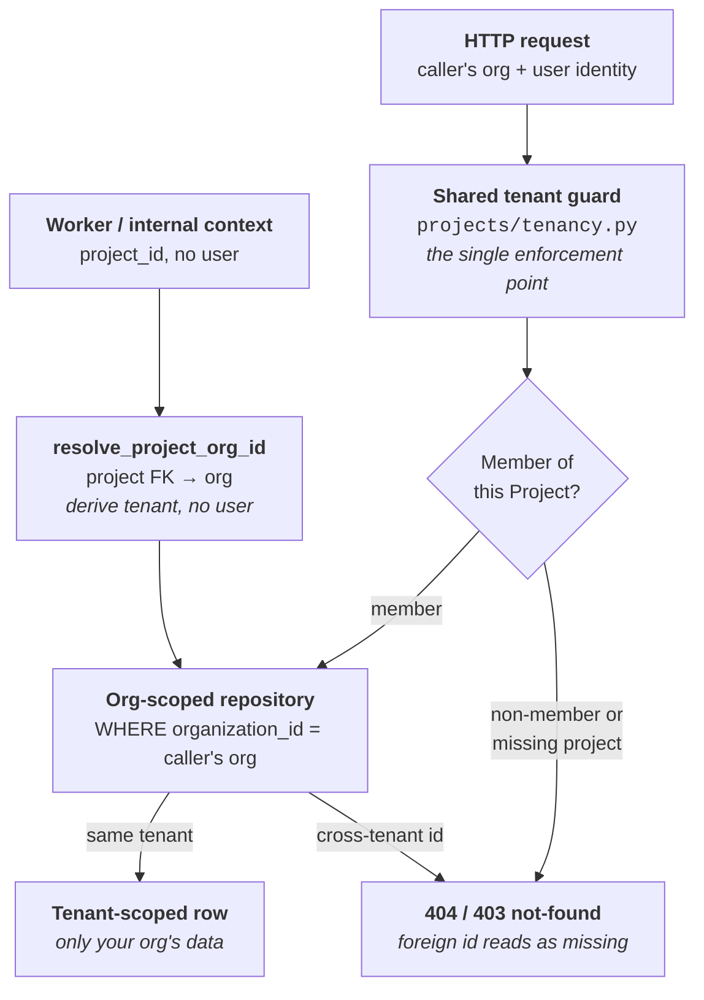

A **[Project](/concepts/projects)** is the workspace boundary you see in the product. **Multi-tenancy** is the boundary the platform enforces *beneath* it: the guarantee that your data never crosses into another customer's tenant, and theirs never crosses into yours.

This page is a security and data-model concept, not a workflow. The claims here are architectural — properties of the schema, the shared tenant guard, and the repository layer — rather than buttons you click. They were checked against the application source during writing; release-tag verification pending. Where that distinction matters, the page says so.

## The organization is the tenant boundary

In Trust AI, an **organization** is the tenant. An organization owns many Projects, and every Project — together with all of its **[Sessions](/concepts/sessions)**, **[Datasets](/concepts/datasets)**, **[Personas](/concepts/scenarios)**, **[Evaluators](/concepts/evaluators)**, **[Evaluations](/concepts/evaluations)**, simulations, and **[Trust Agent](/concepts/trust-agent)** tasks — belongs to exactly one organization. Identity, and the organization itself, are federated through **WorkOS SSO**: your company's single sign-on is the source of truth for who you are and which tenant you belong to.
{/* ACCURACY-AUDIT-PENDING: an organization owns many Projects and every Project + its artifacts belongs to exactly one org; identity + org federated via WorkOS SSO — ADR/code + concepts/projects.mdx framing, not UI-drivable on this page */}

<Info>
  **Organization vs. Project — two different boundaries.** A **Project** is the *workspace* boundary: members, runtime credentials, and the artifacts under evaluation, all in one place (see **[Projects](/concepts/projects)**). An **organization** is the *tenant* boundary: the security perimeter the platform enforces so one customer's data can never reach another's. A Project lives inside exactly one organization; an organization holds many Projects.
</Info>

## organization_id, on every tenant-anchored row

The tenant boundary is carried in the data itself. Every tenant-anchored table has a required `organization_id` column — `NOT NULL`, never optional. That holds across the project-scoped anchor tables (`datasets`, `personas`, `evaluations`, `sessions`, `simulations`) and the agent-core anchor tables (the Trust Agent's tasks and its audit log). Every tenant-anchored row carries a non-null `organization_id`, so the tenant a row belongs to is never ambiguous.
{/* ACCURACY-AUDIT-PENDING: organization_id is NOT NULL on datasets/personas/evaluations/sessions/simulations + agent-core tasks & audit log — schema property verified in models.py (datasets:67, personas:66, evaluations:61, simulations:90, sessions:69, agent domain:174/764), not UI-drivable */}

`organization_id` is **denormalized onto each row from the parent Project at create time**. The platform derives the tenant from the row's Project and stamps it on every child write, so list and index queries can filter by tenant directly instead of joining through `projects`. This is a performance property of the schema, not something you configure.
{/* ACCURACY-AUDIT-PENDING: organization_id denormalized from the parent project at write time so list/index queries filter by tenant without joining through projects — code property (agent domain models.py tenancy-anchor comments; projects/tenancy.py resolve_project_org_id), not UI-drivable */}

## The shared tenant guard

There is one sanctioned place where the cross-tenant check lives: the **shared tenant guard** at `src/domain/projects/tenancy.py`. Any domain whose anchor table points at `projects` imports the guard rather than re-deriving the check itself, so the rule is enforced in a single, audited place instead of being scattered and inconsistent across the codebase.
{/* ACCURACY-AUDIT-PENDING: projects/tenancy.py is the single sanctioned cross-domain enforcement point and domains import it rather than re-deriving the org check — code property (tenancy.py module docstring; release Highlights "behind a shared tenant guard"), not UI-drivable */}

On an HTTP route, **membership is the authoritative access check.** The guard verifies that the Project exists and that you are a member of it:

- You are a **member** → the request proceeds.
- You are a **non-member** → the request is denied.
- The Project **doesn't exist** → the request **fails closed** as a not-found.

{/* ACCURACY-AUDIT-PENDING: on an HTTP route, a project member is allowed, a non-member is denied, and a missing project fails closed as not-found — drive as non-member vs member on the release tag; code: ensure_project_in_tenant_and_user_is_member raises ProjectAccessDeniedError / ProjectNotFoundError */}

<Warning>
  **Membership is the gate — an org mismatch on a valid member self-heals, it does not hard-reject.** If you are a valid member of a Project but your current login organization doesn't match the Project's stored `organization_id`, the guard **auto-reconciles**: it updates the Project's organization to your organization rather than rejecting you. This is deliberate self-healing for stale data left by data migrations, organization switches, and backfills. The thing that *denies* a request is **lack of membership**, not a stale org value on the row.
</Warning>
{/* ACCURACY-AUDIT-PENDING: for a valid member whose login org != the project's stored organization_id, the guard auto-reconciles (project.organization_id = caller's org; commit) rather than rejecting — code property (tenancy.py auto-reconcile branch lines 73-75 + docstring), not UI-drivable; do NOT frame as a hard org-id reject */}

### Workers and background writes

Not every write has a user behind it. Session imports, agent sync receipts and checkpoints, and the evaluation-time simulation driver all run in background or internal contexts with a `project_id` but no user identity. Those callers derive the tenant from the Project's foreign key through `resolve_project_org_id`, so every background write still stamps the correct `organization_id` — there is no path where a tenant-anchored row is written without a tenant.
{/* ACCURACY-AUDIT-PENDING: worker/internal (no-user) contexts derive tenancy from the project FK via resolve_project_org_id so background writes stamp organization_id correctly — code property (tenancy.py resolve_project_org_id; ADR-0019 Decision #3 per-thread state on tenant-scoped tasks/task_turns), not UI-drivable */}

## Denied a second time, at the repository layer

The service-level guard is the first line, not the only one. Beneath it, tenant-scoped repository reads filter on `organization_id` directly, so a cross-tenant id **collapses to a not-found**: ask for another organization's record by id and the query returns nothing, exactly as if the id never existed. This is **defense in depth** — a deliberate belt-and-braces second check so that even a future bug that skipped the service guard would surface an empty result rather than a foreign row.
{/* ACCURACY-AUDIT-PENDING: tenant-scoped repository reads filter on organization_id so a cross-tenant id collapses to None (not-found) — code property (datasets/repository.py:94 collapse-to-None + :858 belt-and-braces; personas/repository.py org filter), not UI-drivable here */}

Because the foreign id collapses to a not-found, **a cross-tenant request returns the same response as a non-existent one.** The boundary never confirms that a foreign record exists — there's no "you're not allowed to see this" leak that would tell an attacker the record is real. Addressing another organization's Dataset, Persona, simulation, or agent task id directly returns a **403 / 404**, indistinguishable from a missing id.
{/* ACCURACY-AUDIT-PENDING: a foreign-tenant id returns the same 403/404 as a non-existent id (no existence leak) — drive Org A → Org B id on the release tag; verified by the agent domain's test_tenant_denial.py under tests/domain (assert status_code in (403, 404)), evaluations/test_tenant_isolation.py, sessions/test_tenant_denial.py */}

### Across the API ↔ gateway boundary

The tenant follows the request even when it leaves the API. When the gateway looks up a simulation, `organization_id` travels in the lookup response body, and the gateway **fails closed if it is absent** — it refuses to run a turn rather than proceeding with an unknown tenant. A missing tenant is treated as a stop condition, not a default.
{/* ACCURACY-AUDIT-PENDING: organization_id travels in the simulation-lookup response body and the gateway fails closed when it is missing — integration property (services/gateway/.../test_api_round_trip.py: test_lookup_reads_organization_id_from_response_body + test_lookup_fails_closed_when_organization_id_is_missing), not UI-drivable */}

<Accordion title="The data-model detail, for the curious">
  You don't need any of this to use Trust AI, but here is the precise shape of the boundary:

  - **The column.** On every tenant-anchored table, `organization_id` is defined as `mapped_column(String(255), ForeignKey("evaluation.workspace_settings.org_id", ondelete="RESTRICT"), nullable=False, index=True)`. It is non-null, indexed for tenant-filtered queries, and foreign-keyed to the organization's workspace settings.
  - **`ondelete="RESTRICT"`.** An organization can't be deleted out from under rows that still reference it — the database refuses, rather than silently orphaning tenant-anchored data.
  - **Denormalized, not joined.** The org is copied from the parent Project onto each child row at write time, so list and index queries filter by tenant without joining through `projects`.
  - **The representative anchor tables.** `datasets`, `personas`, `evaluations`, `sessions`, `simulations`, and the Trust Agent's `tasks` and audit log each carry the column. This is the representative set, not an exhaustive enumeration — the schema is the authority for the full list.

  {/* ACCURACY-AUDIT-PENDING: organization_id column = String(255) FK to evaluation.workspace_settings.org_id, ondelete=RESTRICT, nullable=False, index=True, denormalized from parent project — schema property verified across models.py, not UI-drivable */}
</Accordion>

## The Trust Agent runs inside the boundary

The **[Trust Agent](/concepts/trust-agent)** is not an exception to any of this — it runs inside the same tenant boundary as the rest of the platform. An agent session only ever sees and acts on the current organization's Project data, and an approved write executes only within your own organization and Project: **tenant-scoped, server-anchored, and bound to the specific approval you gave.** The agent cannot read or mutate another organization's records. Its tasks and audit log are tenant-anchored exactly like every other domain, so a cross-tenant agent-task id returns the same 403 / 404 as any other foreign id.
{/* ACCURACY-AUDIT-PENDING: an agent session only sees/acts on the current org's project data; approved writes execute only within the user's org/project (tenant-scoped, server-anchored, approval-bound); cross-tenant agent task/audit id = 403/404 — observable property (agent tasks/audit organization_id NOT NULL + test_tenant_denial.py; ADR-0019 Decision #3; release Trust Agent "secured write execution" #1683), verify by driving the agent on Org A on the release tag */}

The behavioral side of the agent — its shells, transcript, approvals, and what "approve and execute" actually does — lives in **[Trust Agent](/concepts/trust-agent)**. This page only asserts that all of it happens inside the tenant boundary.

## Production infrastructure

Beneath the tenant model sits a production-infrastructure foundation. This is a security and operations *posture*, stated for completeness — not a deployment runbook, and not something you configure as a user of Trust AI:

- Application **secrets are externalized** from the application image, with an in-cluster network policy fronting the shared Redis.
- Real **IRSA** (IAM Roles for Service Accounts) role ARNs are wired, so each service assumes only the AWS permissions it needs.
- The **Envoy HTTPRoute cutover** is complete across the ingress path.
- **Helm values are complete** across the services (API, agent gateway, model gateway, web, worker).
- Database **migrations run via a pre-upgrade hook**, so the schema is brought current before new application code starts.

{/* ACCURACY-AUDIT-PENDING: production-infra posture — externalized secrets + Redis network policy, IRSA role ARNs, Envoy HTTPRoute cutover, complete Helm values, pre-upgrade migration hook — infra property (release Highlights "Production-ready platform" #1733/#1633/#1319; Helm charts + k8s manifests), verify against charts/manifests on the release tag, NOT against the UI */}

<Note>
  The deployment mechanics behind this posture — Helm chart values, IRSA role setup, the Envoy route config, network-policy authoring, and the migration hook — are platform operations, not a user-facing surface. If a deployment runbook is ever needed it will live in its own how-to; this page intentionally stays at the level of *what the boundary guarantees*, not *how it is deployed*.
</Note>

## Related concepts

<CardGroup cols={2}>
  <Card title="Projects" icon="sliders-horizontal" href="/concepts/projects">
    The workspace boundary you see in the product — members, runtime credentials, and artifacts. Multi-tenancy is the organization boundary enforced beneath it.
  </Card>
  <Card title="Trust Agent" icon="bot" href="/concepts/trust-agent">
    The in-app assistant whose writes are tenant-scoped and server-anchored — it runs inside the boundary this page describes.
  </Card>
  <Card title="Playground" icon="play" href="/concepts/playground">
    The chat-and-simulate surface; its simulations are a tenant-anchored domain like every other.
  </Card>
  <Card title="Glossary" icon="book" href="/glossary">
    Quick definitions for organization, Project, tenant, and the rest of the Trust AI vocabulary.
  </Card>
</CardGroup>
