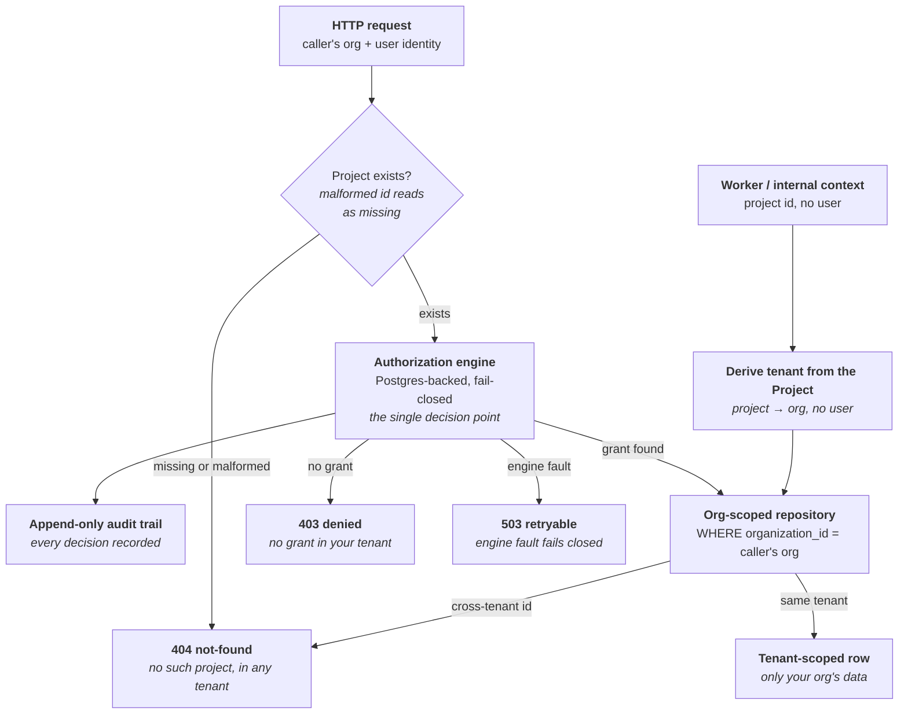

A **[Project](/concepts/projects)** is the workspace boundary you see in the product. **Multi-tenancy** is the boundary the platform enforces *beneath* it: the guarantee that your data never crosses into another customer's tenant, and theirs never crosses into yours.

This page is a security and data-model concept, not a workflow. Two boundaries run through it, and they are separate guarantees: the **tenant** boundary between organizations, and the **grant** boundary between projects inside one organization. Neither one implies the other.

## The organization is the tenant boundary

In Trust AI, an **organization** is the tenant. An organization owns many Projects, and every Project — together with all of its **[Sessions](/concepts/sessions)**, **[Scenarios](/concepts/scenarios)**, **[Evaluators](/concepts/evaluators)**, **[Evaluations](/concepts/evaluations)**, simulations, and **[Trust Agent](/concepts/trust-agent)** tasks — belongs to exactly one organization. Identity, and the organization itself, are federated through your workspace's SSO identity provider: your company's single sign-on is the source of truth for who you are and which tenant you belong to.

<Info>
  **Organization vs. Project — two different boundaries.** A **Project** is the *workspace* boundary: members, runtime credentials, and the artifacts under evaluation, all in one place (see **[Projects](/concepts/projects)**). An **organization** is the *tenant* boundary: the security perimeter the platform enforces so one customer's data can never reach another's. A Project lives inside exactly one organization; an organization holds many Projects.
</Info>

## Access is granted, never inherited

Access to a Project is granted per person — directly, or through a **Team** — and nothing else confers it. A workspace role is not a project grant. **A workspace Owner or Admin who has not been granted access to a Project is denied that Project's content**, exactly as an unrelated member would be: the request comes back **403**, not a partial view.

Grants, teams, members, and invites are administered in **Workspace settings** — see **[Administer workspace access](/how-to/administer-workspace-access)**. Every grant, role change, and removal there is enforced by the same authorization engine described below and written to the same audit trail, which you can read in the **access history** drawer on the **Members** and **Project access** tabs.

The same rule shapes what you can *see*, not just what you can open. The Projects list is built from your grants inside the workspace you are signed in to — direct grants and team-mediated grants, unioned — so a workspace Owner with no grant on any Project sees an empty list rather than the whole workspace.

<Warning>
  **An organization mismatch is denied. It does not repair itself.** If your login organization does not match a Project's stored organization — a multi-org account signed in to the wrong tenant, a stale record left by a migration — the request is **denied (403)** and the Project's organization is left untouched.

  Earlier releases auto-reconciled that mismatch by *moving the Project* into the caller's organization. That behavior was removed in **v2026.07.13.1** as a cross-tenant hazard: it let anyone holding a grant drag a Project between tenants simply by logging in to the other one. Authorization is tenant-isolated now — a grant stamped in one tenant is invisible from another.
</Warning>

## Roles and permissions

Two vocabularies meet here, and they are not the same list. Keep them apart.

**Workspace roles** describe your standing in the workspace:

| Workspace role | What it governs |
| --- | --- |
| **Owner** | Full administrative control of the workspace, its members, and its teams. Conferred, never offered in the invite dialog. |
| **Admin** | Manages members, teams, and access. |
| **Member** | Ordinary standing in the workspace; the default for a new invite. |
| **Guest** | External and project-scoped. Not added to teams. |

**Project access tiers** describe what a grant on one Project confers:

| Project tier | Confers | How you get it |
| --- | --- | --- |
| **Viewer** | Read the Project's content. | Granted — directly or through a team. |
| **Editor** | Read and change the Project's content. | Granted — directly or through a team. |
| **Owner** | Everything, including the Project's lifecycle. | Conferred at creation. Never grantable, never transferable. |

Viewer and Editor are the only two tiers a grant dialog offers. Project **Owner** is not on that menu at all — it belongs to whoever created the Project.

**Project lifecycle is owner-only.** Renaming, archiving, restoring, and deleting a Project require the Project's Owner tier. A workspace Admin without a grant is denied, and so is a project Editor: the gate is stricter than "not ordinary members".

In the product, this reference opens where you need it — a **What can each role do?** link sits beside every role picker, in the invite dialog and in the member sheet, and opens a read-only roles-and-permissions drawer.

<Note>
  The drawer's matrix is drawn from the shared permission catalog, which models a coarse workspace-Owner allowance for project actions. The platform edge does not use it: every project decision resolves through the per-project membership check instead, so the rule on this page — **project content is always gated by a grant, admins and owners included** — is what the API actually enforces.
</Note>

## organization_id, on tenant-anchored rows

The tenant boundary is carried in the data itself. Tenant-anchored tables carry an `organization_id` column, foreign-keyed to the organization and indexed for tenant-filtered queries, and it is required on the tables behind scenarios, personas, evaluations, sessions, simulations, agent versions, agent profiles, saved views, and the Trust Agent's tasks and audit log. The tenant a row belongs to is not ambiguous.

`organization_id` is **denormalized onto each row from the parent Project at write time**. The platform derives the tenant from the row's Project and stamps it on every child write, so list and index queries filter by tenant directly instead of joining through the Projects table. This is a performance property of the schema, not something you configure.

Deletion is restricted: an organization cannot be deleted out from under rows that still reference it. The database refuses rather than silently orphaning tenant-anchored data.

<Note>
  **One table is still catching up.** The `test_runs` table's `organization_id` is nullable at this release — it is stamped where the writing path is plumbed for it, and is scheduled to become required once every writer is. Treat the "required on every tenant-anchored table" statement as true of the domain tables listed above, not as a schema-wide invariant.
</Note>

## One authorization engine, fail closed

Access decisions are not scattered across per-route checks. A single, shared **authorization engine** — Postgres-backed, running inside the platform's own boundary — governs every project-scoped request: who can see and act on every Project, Session, Evaluation, and connected agent. Every domain routes its access decision through the same resolver, so the rule is enforced in one audited place instead of being re-derived inconsistently across the codebase.

```mermaid
flowchart TB
    REQ["<b>HTTP request</b><br/>caller's org + user identity"]
    WRK["<b>Worker / internal context</b><br/>project id, no user"]

    EXISTS{"Project exists?<br/><i>malformed id reads<br/>as missing</i>"}
    ENGINE["<b>Authorization engine</b><br/>Postgres-backed, fail-closed<br/><i>the single decision point</i>"]
    AUDIT["<b>Append-only audit trail</b><br/><i>every decision recorded</i>"]
    RESOLVE["<b>Derive tenant from the Project</b><br/><i>project → org, no user</i>"]

    REPO["<b>Org-scoped repository</b><br/>WHERE organization_id = caller's org"]
    ROW["<b>Tenant-scoped row</b><br/><i>only your org's data</i>"]
    DENY404["<b>404 not-found</b><br/><i>no such project, in any tenant</i>"]
    DENY403["<b>403 denied</b><br/><i>no grant in your tenant</i>"]
    FAULT["<b>503 retryable</b><br/><i>engine fault fails closed</i>"]

    REQ --> EXISTS
    EXISTS -->|"missing or malformed"| DENY404
    EXISTS -->|"exists"| ENGINE
    ENGINE --> AUDIT
    ENGINE -->|"grant found"| REPO
    ENGINE -->|"no grant"| DENY403
    ENGINE -->|"engine fault"| FAULT

    WRK --> RESOLVE
    RESOLVE --> REPO

    REPO -->|"same tenant"| ROW
    REPO -->|"cross-tenant id"| DENY404
```

On an HTTP route, the engine's decision is the authoritative access check, and it **fails closed** at every step:

- The Project **doesn't exist** — or the id is **malformed** — → an honest **not-found (404)**, never a server error.
- You have **no grant** on the Project, in the tenant you are signed in to → the request is **denied (403)**.
- You have a grant → the request proceeds.
- The engine itself **can't reach its database** → the request fails closed as a **retryable 503** rather than proceeding or surfacing an uncaught error. An unavailable check is a denial, not a pass.

**Every decision is audited.** Each access decision and each permission change is written to a durable, **append-only** audit trail — the sink can only insert, never update or delete, so a record, once written, cannot be changed or removed through it. A denial is committed in its own transaction, so the deny that unwinds a request still leaves its audit row behind; a permission change whose audit record fails to write is rolled back, so there is no unaudited mutation.

### What a denial tells you

The boundary is careful about existence, and the rule differs by what you addressed:

- **A record addressed by its own id** — a Session, a Scenario, a Persona, a simulation, an agent version, an agent profile revision, a Trust Agent task — resolves through a tenant-filtered query. Another organization's id **collapses to a not-found**, byte-identical to an id that never existed. There is no "you're not allowed to see this" response to distinguish the two, so nothing confirms that a foreign record is real.
- **A Project id** is deliberately different. A Project that exists in some tenant but that you have no grant on answers **403**; a Project id that exists nowhere answers **404**. The 403 is what makes "ask your admin for access" a coherent thing to tell someone, and it is the same 403 whether the Project sits in your organization or another one — so it separates *does this id exist somewhere* from *whose tenant is it in*, which is the answer that matters.

This is defense in depth, not a single check: beneath the engine, tenant-scoped repository reads filter on `organization_id` directly, so even a path that skipped the engine would surface an empty result rather than a foreign row.

### Isolation inside one organization

Framing everything as cross-customer would understate the boundary. Several reads that were correctly tenant-scoped still returned more than they should have *within* one organization, and **v2026.07.13.1** closed four of them:

| Read | What it returned | What it does now |
| --- | --- | --- |
| A project's connected agents and their stats | Any authenticated user of any organization could read them by Project id. | Requires a grant on that Project, checked before the agent runtime is contacted. |
| A project's dashboard rollup | The same gap. | Requires a grant on that Project, checked before any aggregation runs. |
| A bulk fetch of sessions by id | Every session in your organization, including projects you hold no grant on — a same-organization, cross-project leak. | Membership is verified once per distinct Project the ids span, and sessions in projects you can't reach are dropped from the result. |
| Workspace usage and caching figures | Deployment-wide totals, identical for every workspace. | Caching figures are now genuinely per-organization. |

The usage summary is the honest exception. Its numbers come from the model gateway's own request logs, which carry no per-organization attribution to filter on, so a truthful per-tenant figure cannot be produced today. Rather than fabricate one, the read is **restricted to workspace Owners and Admins** — everyone else is denied. That is *containment*, not tenant isolation: an Owner or Admin still sees deployment-wide totals. The per-tenant fix belongs in the model gateway's logging.

**v2026.07.16.1** closed one more, on the Agent Profile path: a capability profile addressed by a revision or agent-version id is now resolved inside the caller's tenant, and a foreign id collapses to not-found like every other record. See **[Agent Versions](/concepts/agent-versions)**.

### Workers and background writes

Not every write has a user behind it. Session imports, agent sync receipts and checkpoints, and the evaluation-time simulation driver all run in background or internal contexts with a Project id but no user identity. Those callers derive the tenant from the Project record itself — the Project is authoritative for tenancy — so every background write still stamps the correct `organization_id`. There is no path where a tenant-anchored row is written without a tenant, and a missing or malformed Project id fails closed as a not-found here too.

## The agent runtime is internal only

The service that drives your connected agents does not sit on the public edge. Every one of its routes requires a shared internal service token that only the API attaches; the browser never calls it. A caller that reaches the runtime's origin without that token is rejected **401** before any handler runs, and a deployment that has not configured the token rejects *everything* rather than silently opening the surface. The single unguarded route is the health check, which carries no tenant data.

The tenant follows the request across that boundary too. When the runtime looks up a simulation, the organization travels in the lookup response, and the runtime **fails closed if it is absent** — it refuses to run a turn rather than proceeding with an unknown tenant and persisting events without a tenant stamp.

## Connection credentials never come back out

The credentials you give a connection are write-only on the read path. Every secret field is masked in API responses, across all four connectable platforms:

| Platform | Masked in responses |
| --- | --- |
| **Salesforce Agentforce** | Consumer key, consumer secret, private key, client id, client secret, password |
| **AWS Bedrock AgentCore** | Secret access key, session token, bearer token, OAuth client secret, JWT |
| **Claude-managed agent** | API key |
| **Conversational HTTP agent** | Bearer token |

Non-secret configuration — URLs, ids, regions, ARNs — stays visible, because hiding it would cost you the ability to check what a connection points at. A platform the allowlist doesn't yet classify is masked by a conservative name heuristic instead, so a newly added connector is protected by default rather than by someone remembering to update a table.

Masking hides the value, not the fact. The UI still shows a **Configured** status pill and the placeholder `•••• configured — leave blank to keep existing`, so you can tell "a credential is set" from "no credential set" without ever reading one back.

**Destination pinning** completes the pair: a saved credential only ever travels to a saved destination. If a request would repoint a connection at a new URL while re-using the stored secret, the platform refuses — *"For your security, TrustAI will not send this connection's saved credentials to a different Salesforce URL. Re-enter the credentials to point this connection at a new Salesforce URL."* Fields that are signed claims rather than network targets, such as a JWT audience, stay freely editable, and a cosmetic re-send of the same URL is never mistaken for a redirect.

## The Trust Agent runs inside the boundary

The **[Trust Agent](/concepts/trust-agent)** is not an exception to any of this — it runs inside the same tenant boundary as the rest of the platform. An agent session only ever sees and acts on the current organization's Project data, and an approved write executes only within your own organization and Project: **tenant-scoped, server-anchored, and bound to the specific approval you gave.** The agent cannot read or mutate another organization's records. Its tasks and audit log are tenant-anchored exactly like every other domain, so a cross-tenant agent-task id collapses to a not-found like any other foreign record id.

The behavioral side of the agent — its shells, transcript, approvals, and what "approve and execute" actually does — lives in **[Trust Agent](/concepts/trust-agent)**. This page only asserts that all of it happens inside the tenant boundary.

Developers who want the underlying request and response shapes can find them in the [API Reference](/api-reference).

## Related concepts

<CardGroup cols={2}>
  <Card title="Projects" icon="sliders-horizontal" href="/concepts/projects">
    The workspace boundary you see in the product — members, runtime credentials, and artifacts. Multi-tenancy is the organization boundary enforced beneath it.
  </Card>
  <Card title="Administer workspace access" icon="users" href="/how-to/administer-workspace-access">
    The admin surface behind this page: invite members, build teams, and grant per-project Viewer or Editor access.
  </Card>
  <Card title="Trust Agent" icon="sparkles" href="/concepts/trust-agent">
    The in-app assistant whose writes are tenant-scoped and server-anchored — it runs inside the boundary this page describes.
  </Card>
  <Card title="Glossary" icon="book" href="/glossary">
    Quick definitions for organization, Project, tenant, and the rest of the Trust AI vocabulary.
  </Card>
</CardGroup>
