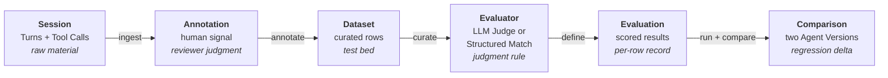

Trust AI is built around seven core nouns. Every workflow, every API call, every screen in the product traces back to one of them. Read this page first, then dig into each noun's dedicated page from the cards below.

## The seven nouns

<CardGroup cols={2}>
  <Card title="Project" icon="sliders-horizontal" href="/concepts/projects">
    The workspace container — owns members, runtime connection config, and every Session, Dataset, Evaluator, Evaluation, and Agent Version under it.
  </Card>
  <Card title="Session" icon="message-square" href="/concepts/sessions">
    One real interaction between a user and an agent — a sequence of Turns and Tool Calls. The raw material every Dataset and Evaluation builds on.
  </Card>
  <Card title="Annotation" icon="tag" href="/concepts/annotations">
    A human-authored pass/fail, rubric score, or freeform comment on a Turn or Session. How reviewer judgment becomes data that Evaluators can calibrate against.
  </Card>
  <Card title="Dataset" icon="database" href="/concepts/datasets">
    A curated, versioned collection of Sessions or Turns. The stable test bed every Evaluation runs against, snapshotted so historical results stay reproducible.
  </Card>
  <Card title="Evaluator" icon="wand-sparkles" href="/concepts/evaluators">
    A reusable judgment function — LLM Judge (plain-English criteria) or Structured Match (deterministic checks). Defined once, reused across many Evaluations.
  </Card>
  <Card title="Evaluation" icon="chart-line" href="/concepts/evaluations">
    A single run of one or more Evaluators across a Dataset, scoped to an Agent Version. Scored, comparable, reviewable — the artifact regressions get caught in.
  </Card>
  <Card title="Agent Version" icon="git-branch" href="/concepts/agent-versions">
    A snapshot of the agent under test — prompt, model, tool set, deployment. Comparing two Agent Versions on the same Dataset is the core regression-testing loop.
  </Card>
</CardGroup>

## How they connect

All of this happens **inside a Project**. The Project is the boundary around the loop — members, runtime credentials, and every artifact above belong to one specific Project. A Trust AI organization may have many Projects (one per agent or agent fleet under evaluation), but a single workflow always stays inside one.

<Tip>
  **Next:** read [The evaluation loop](/concepts/evaluation-loop) for the workflow narrative in depth, or dig into any individual noun from the cards above.
</Tip>

## Vocabulary at a glance

The cards above are the canonical entry points. For quick definitions of every term in the Trust AI vocabulary — including Turn, Tool Call, Skill, and Task (sub-elements and Paddington concepts) — see the [Glossary](/glossary).
