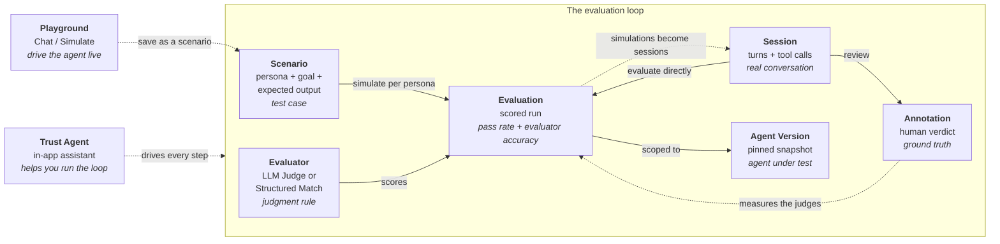

Trust AI is built around seven core nouns. Every workflow and every screen in the product traces back to one of them. Read this page first to see how they fit together, then dig into each one's dedicated page from the cards below.

<Note>
  **Coming from an earlier release?** Scenario sets are gone. Every project now has one flat **Scenarios** list, and the scenario itself — persona, goal, expected output — is the first-class noun.
</Note>

## The seven nouns

<CardGroup cols={2}>
  <Card title="Project" icon="sliders-horizontal" href="/concepts/projects">
    The workspace container — owns members, connection config, and every Session, Scenario, Evaluator, Evaluation, and Agent Version under it.
  </Card>
  <Card title="Session" icon="message-square" href="/concepts/sessions">
    One real conversation between a user and an agent — a sequence of turns and tool calls. Every session carries a Source — Scenario, Playground, or External — and can be evaluated directly.
  </Card>
  <Card title="Annotation" icon="tag" href="/concepts/annotations">
    Human judgment recorded in typed columns on a session — a pass/fail Verdict, a Severity, reviewer notes, and custom columns. The ground truth evaluator accuracy is measured against.
  </Card>
  <Card title="Scenario" icon="users" href="/concepts/scenarios">
    A first-class test case — name, goal, personas, expected output, and linked sessions, with a stable id like `SCN-000123`. Every project keeps them in one flat Scenarios list.
  </Card>
  <Card title="Evaluator" icon="wand-sparkles" href="/concepts/evaluators">
    A reusable judgment function — LLM Judge (plain-English rules) or Structured Match (routing and tool checks). Adopt one from the Trust Library or write your own, then calibrate it against human verdicts.
  </Card>
  <Card title="Evaluation" icon="chart-line" href="/concepts/evaluations">
    A scored run of one or more Evaluators — simulating scenarios against an agent, or grading sessions that already happened — scoped to an Agent Version.
  </Card>
  <Card title="Agent Version" icon="git-branch" href="/concepts/agent-versions">
    A snapshot of the agent under test, connected through AgentCore, Claude Managed Agent, or Salesforce Agentforce. Running the same scenarios against two versions is how regressions get caught.
  </Card>
</CardGroup>

## How they connect

An **Evaluation** grades an agent along one of two paths. **Scenarios** are simulated: each scenario fans out one fresh conversation per attached persona against the **Agent Version** under test. **Sessions** are graded as they are: conversations that already happened — captured from your live agent, the Playground, or a simulation — are scored read-only by **Evaluators**. **Annotations** close the loop in the other direction: a human verdict on a session is the ground truth that measures how often the automated judges agree with a person.

Read the diagram in three layers:

- **Two paths lead into an Evaluation.** A scenario is simulated fresh at run time — one conversation per attached persona, each scored on its own. A session is graded exactly as it happened, without being modified.
- **Annotations point at the judges, not the agent.** A human pass/fail verdict grades evaluator accuracy; it never overrides the session's automated verdict.
- **The loop feeds itself.** Simulated and Playground conversations are saved as real sessions linked to their scenario, so every run leaves reviewable raw material behind — and the vocabulary learned from real sessions is what expected outputs are authored from.

All of this happens **inside a Project**. The Project is the boundary around the loop — members, connection config, and every artifact above belong to one specific Project, and every artifact is scoped to your own organization. Access is decided by a fail-closed authorization engine, every access decision and permission change lands in an append-only audit trail, and members, teams, and per-project Viewer and Editor roles are managed from the app's Access Center. See [Multi-tenancy](/concepts/multi-tenancy) for the security-shaped detail.

<Tip>
  **Next:** read [The evaluation loop](/concepts/evaluation-loop) for the workflow narrative in depth, or dig into any individual noun from the cards above.
</Tip>

## The surfaces layered on the loop

The nouns live on a handful of surfaces, each with a dedicated page. Here is what each one is for.

### The Trust Agent

The **Trust Agent** is the in-app assistant on every project — the **New chat** entry in the left nav, at `/projects/:id/agent`. Ask it to find sessions, create scenarios, draft evaluators, run an evaluation, or analyze a regression, and it works in the open: it streams a transcript, renders the records it touches as clickable objects you can open in context, and pauses for your approval before it writes anything. The chat is durable — streamed turns and pending approvals survive reload and disconnect and pick up where they left off.

On a brand-new project it runs a guided cold start: connect your agent, watch an observe-only exploration of how it actually behaves, author behavior and security coverage — including adversarial scenarios it proposes from the OWASP Agentic AI Top 10 — and get to a first scored evaluation, all in one conversation. The [Trust Agent](/concepts/trust-agent) page covers it in depth.

<Warning>
  **"Trust Agent" and "Agent Version" are two different things that share the word "agent."** Do not conflate them:

  - The **[Trust Agent](/concepts/trust-agent)** is *your* assistant inside Trust AI — the thing that helps you build and run evaluations. It operates *on* your project.
  - An **[Agent Version](/concepts/agent-versions)** is the *customer's agent under test* — a pinned snapshot every Evaluation is scoped to.

  The Trust Agent helps you evaluate Agent Versions. It is never itself "a version." Everywhere this page says "the agent" loosely, the surrounding sentence makes clear which one is meant.
</Warning>

### Scenarios

**Scenarios** is the project's flat list of test cases, at `/projects/:id/scenarios` (old `/datasets` links redirect there). Each scenario opens a fly-in panel: its personas and goals, its expected output, and the sessions linked to it. The **Expected output** editor is the scenario's grading contract — expected behavior (LLM-judge cards), expected actions, and expected routes, chosen from vocabulary the product learned from real sessions rather than typed by hand.

A **persona** is a reusable, project-scoped role-play profile (one can be the project default); a **goal** is what the synthetic user is trying to achieve. At run time every attached persona is simulated and scored on its own, and a goal-only scenario with no persona still simulates. On the wire, scenario reads and edits go through `/v1/scenarios`, with the legacy `/v1/datasets` endpoints still served underneath — the API Reference tab has the full surface. The [Scenarios](/concepts/scenarios) page covers the rest.

### Sessions

A **Session** is both raw material and evaluation target. The Sessions list shows every conversation your agent has had — each with a **Source** chip (**Scenario**, **Playground**, or **External**) and a **Routed To** column — and its primary **Evaluate** action grades real conversations, in bulk or one at a time, using LLM-judge evaluators. Typed annotation columns — **Verdict**, **Severity**, **Reviewer note**, plus custom columns — edit inline in the table or in the session fly-in, and the human verdict they capture is what evaluator accuracy is measured against. See [Sessions](/concepts/sessions) and [Annotations](/concepts/annotations).

### The Playground

The **Playground** at `/projects/:id/playground` drives a connected agent live. A **Chat** / **Simulate** toggle lets you chat with the agent yourself or auto-drive a persona-agent conversation, and **Save as a scenario** turns a run you like into a scenario with the conversation attached as its session. The full surface is the subject of the [Playground](/concepts/playground) page.

### The Trust Library

A new project doesn't start from a blank slate. **Add recommended evaluators** offers 12 curated LLM-judge presets, grouped quality then safety, that become ordinary fully editable evaluators once adopted; **Add recommended scenarios** offers 10 starter safety scenarios mapped to the OWASP Agentic AI Top 10, each paired with the evaluators that score it well. A no-code rubric editor defines what pass and fail mean in plain language — "Passes when… / Fails when…" — and **Tailor with AI** drafts the rules from one sentence about your agent. Once a judge is in use, its **Calibrate** tab measures how often it agrees with sessions a person already marked pass or fail. See [Evaluators](/concepts/evaluators).

### The Evaluation Launcher

A single **Evaluation Launcher** starts every run — from the Scenarios list, a single scenario, the Sessions list, a single session, or the Evaluations page's **+ New evaluation** button, where you pick a source and a saved view. It previews the fan-out before you launch, and **Re-run** on a finished run restores its full configuration — same agent, same judges. Results lead with a dual headline: **Pass rate** (how the agent did) and **Evaluator accuracy** (how often the automated judges agreed with a human's verdict), with a per-persona matrix underneath. See [Evaluations](/concepts/evaluations) and [Saved views](/concepts/saved-views).

## Go deeper

<CardGroup cols={2}>
  <Card title="Trust Agent" icon="sparkles" href="/concepts/trust-agent">
    The in-app assistant that does evaluation work alongside you — streaming transcript, clickable records, human-in-the-loop approvals, and a guided cold start. *Not* an Agent Version.
  </Card>
  <Card title="Scenarios" icon="users" href="/concepts/scenarios">
    Flat, persona-and-goal test cases with an authored grading contract. Create, generate, or adopt them, then run them against your agent.
  </Card>
  <Card title="Playground" icon="joystick" href="/concepts/playground">
    Chat with or simulate against a connected agent live, then save the result as a scenario.
  </Card>
  <Card title="Multi-tenancy" icon="building-2" href="/concepts/multi-tenancy">
    The organization boundary every artifact is scoped to — fail-closed authorization, per-project roles, and an append-only audit trail.
  </Card>
</CardGroup>

<Card title="Evaluate with the Trust Agent" icon="graduation-cap" href="/tutorials/evaluate-with-the-trust-agent">
  An end-to-end walkthrough: drive a real evaluation with the Trust Agent — find sessions, create scenarios, run an Evaluation, and read the result.
</Card>

## Vocabulary at a glance

The cards above are the canonical entry points. For quick definitions of every term in the Trust AI vocabulary — including Turn, Tool Call, Skill, and Task (sub-elements and Trust Agent concepts) — see the [Glossary](/glossary).
