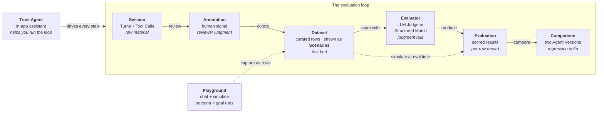

Trust AI is built around seven core nouns. Every workflow, every API call, every screen in the product traces back to one of them. The `v2026.06.09.1` release layers **three new surfaces** on top of those nouns — the **Trust Agent**, **Scenarios**, and the **Playground** — without changing the loop underneath. Read this page first to see how they all fit together, then dig into each one's dedicated page from the cards below.

## The seven nouns

<CardGroup cols={2}>
  <Card title="Project" icon="sliders-horizontal" href="/concepts/projects">
    The workspace container — owns members, runtime connection config, and every Session, Dataset, Evaluator, Evaluation, and Agent Version under it.
  </Card>
  <Card title="Session" icon="message-square" href="/concepts/sessions">
    One real interaction between a user and an agent — a sequence of Turns and Tool Calls. The raw material every Dataset and Evaluation builds on.
  </Card>
  <Card title="Annotation" icon="tag" href="/concepts/annotations">
    A human-authored pass/fail, rubric score, or freeform comment on a Turn or Session. How reviewer judgment becomes data that Evaluators can calibrate against.
  </Card>
  <Card title="Dataset" icon="database" href="/concepts/datasets">
    A curated, versioned collection of Sessions or Turns. The stable test bed every Evaluation runs against, snapshotted so historical results stay reproducible.
  </Card>
  <Card title="Evaluator" icon="wand-sparkles" href="/concepts/evaluators">
    A reusable judgment function — LLM Judge (plain-English criteria) or Structured Match (deterministic checks). Defined once, reused across many Evaluations.
  </Card>
  <Card title="Evaluation" icon="chart-line" href="/concepts/evaluations">
    A single run of one or more Evaluators across a Dataset, scoped to an Agent Version. Scored, comparable, reviewable — the artifact regressions get caught in.
  </Card>
  <Card title="Agent Version" icon="git-branch" href="/concepts/agent-versions">
    A snapshot of the agent under test — prompt, model, tool set, deployment. Comparing two Agent Versions on the same Dataset is the core regression-testing loop.
  </Card>
</CardGroup>

## How they connect

The loop is unchanged: a **Session** is reviewed into **Annotations**, curated into a **Dataset**, scored by **Evaluators** in an **Evaluation**, and the results compared across two **Agent Versions**. The three new surfaces sit *on* that loop rather than replacing any noun:

Read the diagram in three layers:

- **The loop** is the seven nouns, end to end, exactly as before. The **Dataset** is still the curated test bed every Evaluation runs against — one of its list views is now labelled **Scenarios** (more on that below), but the noun, the route, and the API are unchanged.
- **Scenarios and the Playground feed and drive the loop.** A Playground run can be captured back into a Dataset as a row, and a Scenario row that carries a persona and a goal can be simulated fresh at evaluation time instead of replaying stored turns.
- **The Trust Agent helps you run the whole loop.** It is the in-app assistant — it finds Sessions, builds Datasets, drafts Evaluators, and kicks off Evaluations on your behalf, pausing for your approval before it writes.

All of this happens **inside a Project**. The Project is the boundary around the loop — members, runtime credentials, and every artifact above belong to one specific Project. A Trust AI organization may have many Projects (one per agent or agent fleet under evaluation), but a single workflow always stays inside one. Every artifact is **tenant-scoped**: `organization_id` is enforced across the data model behind a shared tenant guard, so a Session, a Scenario set, or a simulation you can see always belongs to your own organization and project — never another tenant's. See [Multi-tenancy](/concepts/multi-tenancy) for the security-shaped detail.
{/* ACCURACY-AUDIT-PENDING: organization_id is enforced NOT NULL across project-scoped + agent-core anchor tables behind a shared tenant guard — verify the cross-tenant isolation property on the release tag (claim 8) */}

<Tip>
  **Next:** read [The evaluation loop](/concepts/evaluation-loop) for the workflow narrative in depth, or dig into any individual noun from the cards above.
</Tip>

## The three surfaces layered on the loop

The `v2026.06.09.1` release adds three surfaces that make the loop faster to drive, without adding an eighth noun to the model.

### The Trust Agent

The **Trust Agent** is the default, flag-free in-app assistant on every project, reached at `/projects/:id/agent`. You ask it to find Sessions, build a Dataset, draft an Evaluator, run an Evaluation, or analyze a regression — and it works in the open: it streams a transcript, renders the records it touches as clickable objects you can open in context, and gates every write behind a human-in-the-loop approval before it changes anything. It helps you run the loop; it does not replace any step of it.
{/* ACCURACY-AUDIT-PENDING: the Trust Agent renders by default at /projects/:id/agent with no ?v2/?agui/?legacy flag, streams a transcript, renders clickable objects, and gates writes behind HITL approval — verify by driving the route on the release tag (claims 3, 10) */}

<Warning>
  **"Trust Agent" and "Agent Version" are two different things that share the word "agent."** Do not conflate them:

  - The **[Trust Agent](/concepts/trust-agent)** is *your* assistant inside Trust AI — the thing that helps you build and run evaluations, at `/projects/:id/agent`. It operates *on* your project.
  - An **[Agent Version](/concepts/agent-versions)** is the *customer's agent under test* — a pinned, immutable snapshot every Evaluation is scoped to. Comparing two Agent Versions is the core regression loop.

  The Trust Agent helps you evaluate Agent Versions. It is never itself "a version." Everywhere this page says "the agent" loosely, the surrounding sentence makes clear which one is meant.
</Warning>

### Scenarios

**Scenarios** is the persona-and-goal-shaped face of the **Dataset** noun — not a new backend domain. The former Datasets list view was restyled to the Scenarios design with **Persona** and **Goal** columns, but the route stays `/projects/:id/datasets` and the API stays `/v1/datasets`. There is no `/v1/scenarios` endpoint; the historical `scenarios` backend domain was deleted long ago (ADR-0002), so "Scenarios" today is a UI-layer name over Datasets, nothing more.
{/* ACCURACY-AUDIT-PENDING: the surface labelled "Scenarios" in the nav opens at /projects/:id/datasets (NOT /scenarios), shows Persona + Goal columns, and calls /v1/datasets with no /v1/scenarios endpoint — verify by driving the route + network tab on the release tag (claim 4) */}

A **persona** is a reusable, project-scoped role-play profile (one of them can be the project default); a **goal** is what the synthetic user is trying to achieve. A Scenario row that carries *both* a persona and a goal can be driven as a live simulation — the input that makes a row "simulatable." A row missing either is replayed instead of simulated. Personas and goals are first-class supporting terms; their full treatment lives on the [Scenarios](/concepts/scenarios) page.
{/* ACCURACY-AUDIT-PENDING: a Scenario row is simulatable only when it carries both a persona and a goal; personas are project-scoped with one optional default — verify against Manage Personas + the new-eval form on the release tag (claim 6) */}

### The Playground

The **Playground** is a per-project surface at `/projects/:id/playground` for driving a connected agent live. A **Chat** / **Simulate** toggle lets you either chat with the agent yourself (Chat mode) or auto-drive a persona ↔ agent conversation (Simulate mode), and you can capture the result back into a Scenario set as a row. It is where Scenarios get exercised before they ever reach an Evaluation. The full surface is the subject of the [Playground](/concepts/playground) page.
{/* ACCURACY-AUDIT-PENDING: the Playground is at /projects/:id/playground with an agent picker and a Chat / Simulate toggle; Chat streams a live reply and a run can be captured as a Scenario — verify by driving the route on the release tag (claim 5) */}

### Simulation at evaluation time

These surfaces connect back into the evaluation loop at one specific seam. An **Evaluation** run can simulate a fresh persona ↔ agent conversation per simulatable Scenario row *at evaluation time* — a per-run **Simulate at eval time** opt-in — instead of replaying the row's stored input turns. That is the boundary where Scenarios and the Playground rejoin the existing loop; the toggle mechanics and the persisted simulated transcript are covered in [Simulate with Scenarios](/how-to/simulate-with-scenarios) and on the [Evaluations](/concepts/evaluations) page.
{/* ACCURACY-AUDIT-PENDING: a per-run "Simulate at eval time" toggle on the new-run form runs persona+goal simulation per simulatable row instead of replaying stored turns — verify by driving the new-eval form on the release tag (claim 7) */}

## The new surfaces

<CardGroup cols={2}>
  <Card title="Trust Agent" icon="bot" href="/concepts/trust-agent">
    The in-app assistant that does evaluation work alongside you — streaming transcript, clickable records, and human-in-the-loop approvals before it writes. *Not* an Agent Version.
  </Card>
  <Card title="Scenarios" icon="users" href="/concepts/scenarios">
    Persona-and-goal test sets — the persona/goal-shaped face of the Dataset noun. Build, generate, and simulate agents against them. Route stays `/projects/:id/datasets`.
  </Card>
  <Card title="Playground" icon="joystick" href="/concepts/playground">
    Chat with or simulate against a connected agent live, then capture the result as a Scenario. The Chat / Simulate surface that pairs with Scenarios.
  </Card>
  <Card title="Multi-tenancy" icon="building-2" href="/concepts/multi-tenancy">
    The organization boundary every artifact is scoped to — `organization_id` enforced across the data model behind a shared tenant guard.
  </Card>
</CardGroup>

<Card title="Evaluate with the Trust Agent" icon="graduation-cap" href="/tutorials/evaluate-with-the-trust-agent">
  An end-to-end walkthrough: drive a real evaluation with the Trust Agent — find Sessions, build a Scenario set, run an Evaluation, and read the result.
</Card>

## Vocabulary at a glance

The cards above are the canonical entry points. For quick definitions of every term in the Trust AI vocabulary — including Turn, Tool Call, Skill, and Task (sub-elements and Paddington concepts) — see the [Glossary](/glossary).
