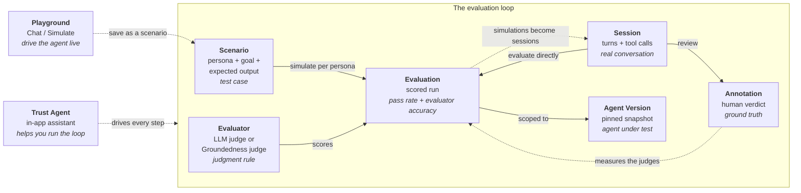

Trust AI is built around seven core nouns. Every workflow and every screen in the product traces back to one of them. Read this page first to see how they fit together, then dig into each one's dedicated page from the cards below.

<Note>
  **Coming from an earlier release?** Scenario sets are gone. Every project now has one flat **Scenarios** list, and the scenario itself — persona, goal, expected output — is the first-class noun.
</Note>

## The seven nouns

<CardGroup cols={2}>
  <Card title="Project" icon="sliders-horizontal" href="/concepts/projects">
    The workspace container — owns members, connection config, and every Session, Scenario, Evaluator, Evaluation, and Agent Version under it.
  </Card>
  <Card title="Session" icon="database" href="/concepts/sessions">
    One real conversation between a user and an agent — a sequence of turns and tool calls. Every session carries a Source — Scenario, Playground, or External — and can be evaluated directly.
  </Card>
  <Card title="Annotation" icon="tag" href="/concepts/annotations">
    Human judgment recorded in typed columns on a session — a pass/fail Verdict, a Severity, reviewer notes, and custom columns. The ground truth evaluator accuracy is measured against.
  </Card>
  <Card title="Scenario" icon="flask-conical" href="/concepts/scenarios">
    A first-class test case — name, goal, personas, expected output, and linked sessions, with a stable id like `SCN-000123`. Every project keeps them in one flat Scenarios list.
  </Card>
  <Card title="Evaluator" icon="ruler" href="/concepts/evaluators">
    A reusable judgment function. Two kinds are yours to create: an **LLM judge** (plain-language grading rules) and a **Groundedness judge** (checks each claim against the scenario's reference material). Adopt a recommended preset or write your own, then calibrate it against human verdicts.
  </Card>
  <Card title="Evaluation" icon="chart-line" href="/concepts/evaluations">
    A scored run of one or more Evaluators — simulating scenarios against an agent, or grading sessions that already happened — scoped to an Agent Version.
  </Card>
  <Card title="Agent Version" icon="git-branch" href="/concepts/agent-versions">
    A snapshot of the agent under test, connected through one of four connectable platforms. Running the same scenarios against two versions is how regressions get caught.
  </Card>
</CardGroup>

## How they connect

An **Evaluation** grades an agent along one of two paths. **Scenarios** are simulated: each scenario fans out one fresh conversation per attached persona against the **Agent Version** under test. **Sessions** are graded as they are: conversations that already happened — captured from your live agent, the Playground, or a simulation — are scored read-only by **Evaluators**. **Annotations** close the loop in the other direction: a human verdict on a session is the ground truth that measures how often the automated judges agree with a person.

```mermaid
flowchart LR
    subgraph loop["The evaluation loop"]
        direction LR
        C["<b>Scenario</b><br/>persona + goal +<br/>expected output<br/><i>test case</i>"]
        S["<b>Session</b><br/>turns + tool calls<br/><i>real conversation</i>"]
        A["<b>Annotation</b><br/>human verdict<br/><i>ground truth</i>"]
        E["<b>Evaluator</b><br/>LLM judge or<br/>Groundedness judge<br/><i>judgment rule</i>"]
        R["<b>Evaluation</b><br/>scored run<br/><i>pass rate + evaluator accuracy</i>"]
        V["<b>Agent Version</b><br/>pinned snapshot<br/><i>agent under test</i>"]

        C -->|simulate per persona| R
        S -->|evaluate directly| R
        E -->|scores| R
        R -->|scoped to| V
        S -->|review| A
        A -.->|measures the judges| R
        R -.->|simulations become sessions| S
    end

    P["<b>Playground</b><br/>Chat / Simulate<br/><i>drive the agent live</i>"]
    TA["<b>Trust Agent</b><br/>in-app assistant<br/><i>helps you run the loop</i>"]

    P -.->|save as a scenario| C
    TA -.->|drives every step| loop
```

Read the diagram in three layers:

- **Two paths lead into an Evaluation.** A scenario is simulated fresh at run time — one conversation per attached persona, each scored on its own. A session is graded exactly as it happened, without being modified.
- **Annotations point at the judges, not the agent.** A human pass/fail verdict grades evaluator accuracy; it never overrides the session's automated verdict.
- **The loop feeds itself.** Simulated and Playground conversations are saved as real sessions linked to their scenario, so every run leaves reviewable raw material behind — and the vocabulary learned from real sessions is what expected outputs are authored from.

**[Requirements](/concepts/requirements) sit above the seven, not among them.** A requirement is what your agent must do or must never do, in business language; the nouns above are the machinery that proves it. It has its own top-level nav entry, and it comes straight after connecting an agent in the authoring order the Trust Agent enforces at run time — ask the agent to generate scenarios before a requirement is saved and it refuses rather than guessing, offering to draft them with you first. Every later step chains off it, so coverage is computable end to end: because each evaluator is authored for a requirement and attached to that requirement's own scenarios, a run's evidence has somewhere to roll up to.

All of this happens **inside a Project**. The Project is the boundary around the loop — members, connection config, and every artifact above belong to one specific Project, and every artifact is scoped to your own organization. Access is decided by a fail-closed authorization engine, every access decision and permission change lands in an append-only audit trail, and members, teams, and per-project Viewer, Editor, and Admin roles are managed from **Workspace settings** — whose **Connected orgs** tab holds the Salesforce org authorizations the whole workspace draws on. See [Multi-tenancy](/concepts/multi-tenancy) for the security-shaped detail.

<Tip>
  **Next:** read [The evaluation loop](/concepts/evaluation-loop) for the workflow narrative in depth, or dig into any individual noun from the cards above.
</Tip>

## The surfaces layered on the loop

The nouns live on a handful of surfaces, each with a dedicated page. Here is what each one is for.

### The Trust Agent

The **Trust Agent** is the in-app assistant on every project — the **New chat** entry in the left nav, at `/projects/:id/agent`. Ask it to find sessions, create scenarios, draft evaluators, run an evaluation, or analyze a regression, and it works in the open: it streams a transcript, renders the records it touches as clickable objects you can open in context, and pauses for your approval before it writes anything. The chat is durable — streamed turns and pending approvals survive reload and disconnect and pick up where they left off.

On a brand-new project it runs a guided cold start: connect your agent, watch an observe-only exploration of how it actually behaves, author behavior and security coverage — including adversarial scenarios it proposes from the OWASP Agentic AI Top 10 — and get to a first scored evaluation, all in one conversation. The [Trust Agent](/concepts/trust-agent) page covers it in depth.

<Warning>
  **"Trust Agent" and "Agent Version" are two different things that share the word "agent."** Do not conflate them:

  - The **[Trust Agent](/concepts/trust-agent)** is *your* assistant inside Trust AI — the thing that helps you build and run evaluations. It operates *on* your project.
  - An **[Agent Version](/concepts/agent-versions)** is the *customer's agent under test* — a pinned snapshot every Evaluation is scoped to.

  The Trust Agent helps you evaluate Agent Versions. It is never itself "a version." Everywhere this page says "the agent" loosely, the surrounding sentence makes clear which one is meant.
</Warning>

### Scenarios

**Scenarios** is the project's flat list of test cases, at `/projects/:id/scenarios` (old `/datasets` links redirect there). Each scenario opens a fly-in panel with four tabs — **Personas & Goals**, **Expected Output**, **Test Data**, and **Sessions**. The **Expected Output** editor is the scenario's grading contract, in three sections — **Expected behavior** (the evaluators that grade the scenario), **Expected actions**, and **Expected routes** — with actions and routes chosen from vocabulary the product learned from real sessions rather than typed by hand. Structural checks live here, on the scenario being graded: creating a standalone **Structured match** evaluator is retired, and the create form no longer offers it. Existing ones keep working.

**Reference material** is the fourth thing that editor can hold, and it is not a fourth section: it nests *inside* **Expected behavior**, and only appears once a **Groundedness judge** is attached to the scenario. It holds the source documents that judge checks the agent's claims against. Reference material belongs to the scenario, never to the evaluator, so the same judge can grade different scenarios against different sources. Until material is attached, a scenario with a Groundedness judge on it cannot run, and the editor says so.

**Test Data** is the scenario's other authored contract, and it is about records rather than replies. One scenario carries one plan, rendered as five step cards — **Create what this test needs**, **Run the conversation**, **Read back what the agent created**, **Check what should happen**, and **Clean up everything this test created**. Author it from **Set up with AI** or **Add manually** on an empty plan and **Edit plan** thereafter; all three open the same docked drawer, and an AI proposal is always reviewable before it replaces what you had saved. The **Expected end state** on the check step is the records a finished run should find — a different contract from Expected Output, which grades what the agent said and did. Cleanup runs on every run and cannot be turned off. See [Test data](/concepts/test-data).

A **persona** is a reusable, project-scoped role-play profile (one can be the project default); a **goal** is what the synthetic user is trying to achieve. At run time every attached persona is simulated and scored on its own, and a goal-only scenario with no persona still simulates. On the wire, `/v1/scenarios` is the whole surface — the older `/v1/datasets` container endpoints were removed, and a scenario is addressed directly under its project. The [API Reference](/api-reference) owns the endpoint detail; the [Scenarios](/concepts/scenarios) page covers the rest.

### Sessions

A **Session** is both raw material and evaluation target. The Sessions list shows every conversation your agent has had, and **Routed To** is one of the columns it opens with. Every session also carries a **Source** — **Scenario**, **Playground**, or **External** — but that column is off by default: turn it on from **Add column**, where it sits under **Hidden columns** alongside User, Duration, and Tags. Typed annotation columns — **Verdict**, **Severity**, **Reviewer note**, plus custom columns — edit inline in the table or in the session fly-in, and the human verdict they capture is what evaluator accuracy is measured against.

Click a session to open its fly-in, which carries five tabs: **Transcript**, **Annotations**, **Evaluations**, **Test Data** — what Trust AI set up, read back, and cleaned up around this one conversation — and **Details**. The list's primary **Evaluate** action grades real conversations in bulk; the same action inside one session's fly-in starts a **quick evaluation**, which grades that conversation in place. A quick evaluation announces itself with a **Quick evaluation started** toast, counts the checks as they land, and finishes with a toast carrying a **View** action; because it mints no run record, it appears on the Evaluations list as a row with a muted **Quick** pill that opens the conversation it graded rather than a run-detail page. See [Sessions](/concepts/sessions) and [Annotations](/concepts/annotations).

### The Playground

The **Playground** at `/projects/:id/playground` drives a connected agent live. A **Chat** / **Simulate** toggle lets you chat with the agent yourself or auto-drive a persona-agent conversation, and **Save as a scenario** turns a run you like into a scenario with the conversation attached as its session. The composer takes pictures as well as text — **Attach images**, in PNG, JPEG, WebP, or GIF — and the agent under test receives the real image rather than a file name. The topbar's info button, tooltipped **Agent profile**, is the only live entry point to the connected agent's [Agent Profile](/concepts/agent-profile) at this release. The full surface is the subject of the [Playground](/concepts/playground) page.

### Connections, Agent Versions, and Agent Profiles

An Agent Version has to come from somewhere. Connections are configured per project from **Project Settings → Connections**, where **Connect an agent** opens the wizard. One tab covers the whole job now; the two that used to split it are gone, and their old links land here. Four platforms are connectable today:

| Platform | Guide |
| --- | --- |
| **AWS Bedrock AgentCore** | [Connect an AWS Bedrock AgentCore agent](/how-to/connect-agentcore) |
| **Salesforce Agentforce** | [Connect a Salesforce Agentforce agent](/how-to/connect-agentforce) |
| **Claude Managed Agent** | [Connect a Claude Managed Agent](/how-to/connect-claude-managed-agent) |
| **Conversational HTTP agent** | [Connect a Conversational HTTP agent](/how-to/connect-http-agent) |

The **Conversational HTTP agent** connector is the general-purpose one: it connects any agent that accepts AG-UI run requests and streams AG-UI events back over SSE, so an in-house agent does not need a vendor connector to be evaluated. On Salesforce, the admin-authorize path — **Authorize TrustAI as an admin (recommended)** — is the way to create a connection.

Each connection is a card, and the card answers two different questions in two vocabularies that never substitute for one another: *is setup finished?* (**Connected / Setting up / Needs admin / Setup failed**) and *can Trust AI reach it right now?* (**Connected / Partly reachable / Can’t reach it / Not checked yet**). A connection nobody has probed reads **Not checked yet** rather than borrowing a green from somewhere else. **Customize environment** expands the card in place to hold that connection's test data stores, its cleanup promise, how many tests may run at once, and its optional test users. See [Manage a project's connections](/how-to/manage-project-connections).

Once a version is connected, its **[Agent Profile](/concepts/agent-profile)** is the captured record of what that build could actually do — its identity, the tools it exposes, and the knowledge sources it draws on. A profile is *about* a version and nests under it, so the two are never the same noun: an Evaluation pins an **agent version**, while a Trust Agent session pins a **profile revision**, the profile's versioned unit. Profiles carry their own lifecycle — **Profile queued**, **Profile in progress**, **Profile available**, **Profile failed**, **Profile out of date** — and report coverage as **Captured**, **Partial**, or **Limited** rather than as a percentage. Automatic capability discovery is implemented for Conversational HTTP, Claude Managed Agent, and Salesforce Agentforce connections; an AgentCore connection reports that agent profiling isn't available for it yet.

### The two recommended catalogs

A new project doesn't start from a blank slate. Two curated catalogs ship, with two entry points that are **not** interchangeable — adopting scenarios brings checks with it, because each probe names the checks that grade it; adopting checks never brings scenarios.

**Add recommended** on the **Evaluators** page opens **Add recommended evaluators**: 11 LLM-judge presets, five **Quality** and six **Safety**, that become ordinary, fully editable evaluators the moment you adopt them. Every one of them returns a pass or a fail on the run — two, *Answer is complete* and *Accomplished the goal*, are authored on a 1–5 shape with 3 as the cutoff, but the judge is asked for a verdict, not a score, so a graded number is never what you read. Three presets — *Accomplished the goal*, *Stays within scope*, *No unauthorized commitments* — carry a **Tailor first** badge, because their criteria defer to what *your* agent is allowed to do; the badge nudges and never blocks adoption. The confirm button counts what you picked (**"Add 4 evaluators"**), and a preset already in the project is muted as **In your project**.

**Add recommended scenarios** on the **Scenarios** page opens the [recommended security scenarios](/concepts/trust-library): 10 adversarial probes, one per failure mode in the OWASP Top 10 for Agentic Applications, each arriving with the safety checks that grade it already attached. Adoption offers two actions and a dismiss, not three equal buttons — **Add & tailor to your agent** is the primary, **Add without tailoring** the secondary, **Cancel** the way out. Tailoring completes adoption immediately and then runs unattended in the background, reading your agent's captured profile so a generic probe becomes specific to the agent under test. With no agent connected the primary is disabled under the nudge **"Connect an agent to tailor these"** — adoption itself never blocks.

A no-code rubric editor defines what pass and fail mean in plain language — "Passes when… / Fails when…" — and **Tailor with AI** drafts the rules from one sentence about your agent. Once a judge is in use, its **Calibrate** tab measures how often it agrees with scenarios a person already marked pass or fail. See [Evaluators](/concepts/evaluators).

### Drive the loop from your own MCP client

Trust AI is also an **MCP server** — an ordinary shipped surface, not a preview. An MCP client you already work in (Claude Code, Codex, or anything else that speaks the protocol) is pointed at your workspace with a URL, and one person approves one browser consent screen naming the app, the account, and the workspace. Sign-in is your workspace's SSO identity provider, and the answer on that screen is one of **Read only**, **Read and write**, or **Read and write, act mode**. From then on your own agent can write requirements, draft and save judges, create scenarios and their personas, launch runs, and gather the evidence to adjudicate a single conversation — through six tools, each covering a whole capability area, without anyone opening the product. See [MCP integration](/concepts/mcp-integration) for the surface and [Connect an MCP client](/how-to/connect-mcp-client) for the setup.

<Note>
  **Three different things are called "Act."** The Trust Agent's **Act** is one of its three operating modes, and it still stops for every mutating write. MCP **act mode** is a property of one granted bearer token, which skips the per-change approval for that connection. A **standing approval** is a third thing again — the Trust Agent's durable, chat-wide grant. None of them implies another.
</Note>

### The Evaluation Launcher

A single **Evaluation Launcher** starts every run — from the Scenarios list, a single scenario, the Sessions list, a single session, or the Evaluations page's **New evaluation** button, where you pick a source. Only the **Sessions** source takes a [saved view](/concepts/saved-views); picking **Scenarios** gives you a scenario picker instead. It previews the fan-out before you launch, and **Re-run** on a finished run restores its configuration — same agent, same judges — with one exception: **Repeat each test case** resets to 1. Results lead with **Pass rate** (how the agent did), with a per-persona matrix underneath. **Evaluator accuracy** (how often the automated judges agreed with a human's verdict) joins it as a second headline once there are human verdicts to score the judges against, and stays hidden when there are none.

**Pass rate is not always a number.** A finished run that produced no behavioural grade reads the neutral **Not graded** rather than a fabricated 0% — completed-conversation counters are evidence of progress, not a grading denominator. Two refinements say *why* when the record can evidence it: **Run only — nothing was graded** for a deliberate simulation, and **Not graded — no evaluators** for a graded run that inherited none. Read plain **Not graded** as "evidence exists, nothing scored it"; it is a different label from **Not evaluated**, which means no evaluation exists at all.

**And a pass rate never reports alone.** Five outcomes leave the pass-rate denominator, and only four of them are the environment's fault — exclusion and attribution are separate axes. The four environmental ones render grey under **Guardrail blocked**, **Environment problem**, or **Access blocked**, with the keystone line *"Environment problem — not the agent · Excluded from the score."* The fifth is the agent's own action throwing an error, and it is not an environment problem at all: it reads amber as **Couldn't test**, summarised as *"Not scored because an action the agent runs returned an error."* Because the run list carries an amber count beside the pass rate, a green rate never renders uncaveated. Two more neutral words are reserved for these screens and coined nowhere else — **Not scored** and **Unverified**, the latter for a conversation whose execution trace has not published yet. The noun on all of them is **conversations**. See [Evaluations](/concepts/evaluations) and [Saved views](/concepts/saved-views).

### Workspace credits

The work behind the loop — simulating scenarios, running judges, and the Trust Agent's own turns — draws on a **credit pool** that belongs to the workspace, not to any one project. **Workspace Settings → Credits** shows **Credit usage** for the current billing month and a **Where your credits went** breakdown. The pool resets monthly.

When the pool runs out, runs stop rather than degrade: the workspace sees a **Credit limit reached** banner, and a run that would exceed the limit is refused with a message telling you to contact your admin.

## Go deeper

<CardGroup cols={2}>
  <Card title="Trust Agent" icon="sparkles" href="/concepts/trust-agent">
    The in-app assistant that does evaluation work alongside you — streaming transcript, clickable records, human-in-the-loop approvals, and a guided cold start. *Not* an Agent Version.
  </Card>
  <Card title="Scenarios" icon="flask-conical" href="/concepts/scenarios">
    Flat, persona-and-goal test cases with an authored grading contract. Create, generate, or adopt them, then run them against your agent.
  </Card>
  <Card title="Playground" icon="play" href="/concepts/playground">
    Chat with or simulate against a connected agent live, then save the result as a scenario.
  </Card>
  <Card title="Evaluators" icon="ruler" href="/concepts/evaluators">
    The full judgment taxonomy — which kinds you create, which are authored on a scenario instead, and how the Groundedness judge uses reference material.
  </Card>
  <Card title="Agent Profile" icon="id-card" href="/concepts/agent-profile">
    The captured record of what one agent build could do — identity, tools, knowledge sources, and how much of it Trust AI could see.
  </Card>
  <Card title="Requirements" icon="list-checks" href="/concepts/requirements">
    What the agent must do and must never do, in business language — the step-2 gate everything downstream is authored against, and the health rollup it earns.
  </Card>
  <Card title="Test data" icon="database" href="/concepts/test-data">
    The records a scenario creates, reads back, checks, and cleans up — one plan per scenario, and the run report of what actually happened.
  </Card>
  <Card title="MCP integration" icon="cable" href="/concepts/mcp-integration">
    Trust AI as an MCP server: the six tools, the three access levels a person grants at the consent screen, and what act mode never covers.
  </Card>
  <Card title="Multi-tenancy" icon="building-2" href="/concepts/multi-tenancy">
    The organization boundary every artifact is scoped to — fail-closed authorization, per-project roles, and an append-only audit trail.
  </Card>
</CardGroup>

<Card title="Evaluate with the Trust Agent" icon="graduation-cap" href="/tutorials/evaluate-with-the-trust-agent">
  An end-to-end walkthrough: drive a real evaluation with the Trust Agent — find sessions, create scenarios, run an Evaluation, and read the result.
</Card>

## Vocabulary at a glance

The cards above are the canonical entry points. For quick definitions of every term in the Trust AI vocabulary — including Turn, Tool Call, Skill, and Task (sub-elements and Trust Agent concepts) — see the [Glossary](/glossary).
