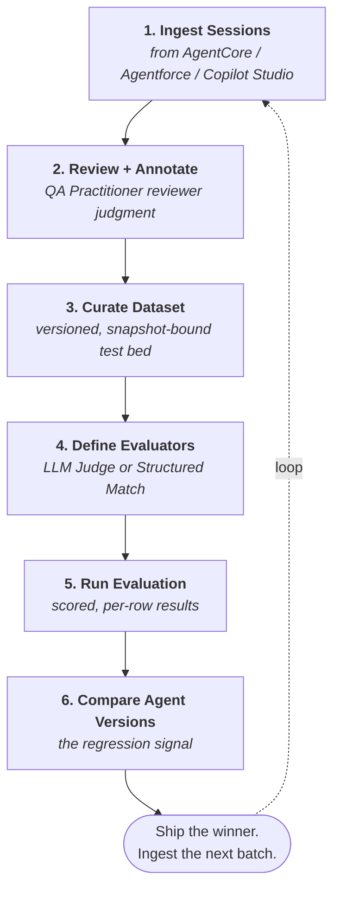

<Info>
  You are viewing the **v2026.05.11** archive. The latest documentation is at [`/`](/) — go there unless you specifically need the v2026.05.11 snapshot.
</Info>

The Trust AI workflow is a **loop, not a line**. Each step feeds the next; the output of the final step closes back to the start. Every concept page in this section is one verb in this loop. Read this page to see how they connect.

## In one paragraph

You **ingest Sessions** from your agent runtime. You **review** them, attaching **Annotations** that capture pass/fail or rubric judgment. You **curate** the most informative annotated Sessions into a **Dataset**. You **define Evaluators** — LLM Judges and Structured Match assertions — and calibrate them against the Annotations until their scores agree with human reviewers. You **run an Evaluation** by applying those Evaluators across the Dataset, scoped to a specific **Agent Version**. When you ship a candidate Agent Version, you **compare its Evaluation results to the prior version's** — that diff is the regression signal. Then you ingest the next batch of Sessions and the loop continues.

## The diagram

The loop is not strictly linear — you'll often define an Evaluator before fully curating a Dataset, or curate a Dataset before having any Annotations. The arrows show the **dependency direction**, not a forced sequence.

## The six steps in depth

### 1. Ingest Sessions

Your agent runtime emits invocation logs. Trust AI's ingestion pipeline pulls those logs (or you push them via API) and surfaces each invocation as a structured **Session** in your **Project**.

V0 supports AWS Bedrock AgentCore via a cross-account IAM role. Agentforce and Copilot Studio connectors are on the roadmap. The ingestion path is read-only; Trust AI never modifies the source runtime.

**Read more:** [Sessions](/concepts/sessions) · [Connect an AWS Bedrock AgentCore agent](/how-to/connect-agentcore)

### 2. Review and annotate

A **QA Practitioner** opens a Session, walks it Turn by Turn, and attaches **Annotations** capturing reviewer judgment — pass/fail, rubric score, or freeform comment. Annotations are the **human signal** that everything downstream calibrates against.

The Annotations queue is the working surface here: filtered lists of Sessions needing review, organized by tag, intent, or recency. A team can blow through a few hundred Sessions in a sitting once the workflow clicks.

**Read more:** [Annotations](/concepts/annotations) *(coming soon)* · [Sessions](/concepts/sessions)

### 3. Curate a Dataset

Annotated Sessions become the raw material for a **Dataset** — a versioned, curated collection of test cases. The Dataset is the stable test bed every Evaluation runs against. You filter, bulk-select, and snapshot the annotated Sessions into a Dataset; the human judgment travels with each row.

A row in a Dataset is a **snapshot** of the source Session, not a deep-link. Upstream edits don't change historical Evaluation results (ADR 0004). That's the core reproducibility guarantee.

**Read more:** [Datasets](/concepts/datasets)

### 4. Define Evaluators

An **Evaluator** is a reusable judgment function: defined once, applied to many Evaluations. Two families:

- **LLM Judge** — a plain-English rubric scored by a strong LLM at evaluation time. Good for qualitative judgment (politeness, completeness, accuracy of unstructured text).
- **Structured Match** — a deterministic assertion on agent output metadata (intent code, tool-call shape, schema validation). Good for structured judgment.

You **calibrate** each Evaluator against the Annotations from step 2 — refining the rubric or assertion until the Evaluator scores rows the way human reviewers did. Calibration agreement is what makes the Evaluator trustworthy as a regression signal.

**Read more:** [Evaluators](/concepts/evaluators) · [Write an effective LLM-judge prompt](/how-to/write-llm-judge-prompt) *(coming soon)*

### 5. Run an Evaluation

An **Evaluation** is a single run: pick a Dataset, pick one or more Evaluators, pick an Agent Version, and kick it off. Trust AI sends each Dataset row to the live agent (via the Project's runtime connection), collects responses, scores them with the Evaluators, and produces a per-row scored result.

A subtle but important pattern (ADR 0006): **the agent responses produced during an Evaluation are themselves Sessions**, structurally indistinguishable from production Sessions. They show up in your Sessions list tagged "from-eval," available for re-annotation, re-evaluation, or curation into the next Dataset. The loop is genuinely a loop.

**Read more:** [Evaluations](/concepts/evaluations) · [Run your first Evaluation](/tutorials/run-first-evaluation) *(coming soon)*

### 6. Compare Agent Versions

The headline workflow: same Dataset, same Evaluators, two **Agent Versions** (production vs. candidate replacement, last week vs. today, prompt-A vs. prompt-B). The comparison surfaces per-row deltas — rows that passed before and fail now (regressions), rows that failed before and pass now (improvements), and rows that flap (a calibration smell).

This is the regression-tracking primitive Trust AI is built around. The product exists to make this diff reliable, reviewable, and routine.

**Read more:** [Compare two Agent Versions](/how-to/compare-agent-versions) *(coming soon)* · [Agent Versions](/concepts/agent-versions) *(coming soon)*

## Where this fits in your team's workflow

Different roles touch different parts of the loop:

<CardGroup cols={3}>
  <Card title="SI Consultant" icon="user-cog">
    **Touches all six steps** during a customer engagement. Sets up the Project, connects the runtime, leads the first wave of Annotations, scaffolds Datasets and Evaluators, runs the first Evaluations, then hands off recurring operations to the customer team.
  </Card>
  <Card title="QA Practitioner" icon="clipboard-check">
    **Lives in steps 2 and 3** — the Annotations queue and Dataset curation. Spends real time per week here; their judgment is what makes every downstream Evaluator possible.
  </Card>
  <Card title="Agent Owner" icon="user-shield">
    **Lives in steps 5 and 6** — running Evaluations on candidate Agent Versions, reading regression reports, making ship / don't-ship decisions. Touches the loop weekly or per-release, not daily.
  </Card>
</CardGroup>

The personas overlap on real teams. A solo founder might play all three. A larger customer may have dozens of QA Practitioners, a few Agent Owners, and one SI Consultant who set the whole thing up.

## What to do with the results

The output of step 6 is rarely a single number. It's a diff with structure. Three common outcomes:

- **Ship the candidate.** Pass rate improved; regressions are absent or acceptable. Tag the new Agent Version as the production version and start the loop fresh.
- **Investigate a regression.** A category of rows failed. Open the failing rows, read the reasoning, decide whether the agent regressed, the Evaluator is over-rejecting, or the Dataset row is no longer valid. Each of those points back into the loop at a different step.
- **Refine the Evaluator.** The Evaluator and the human reviewer disagree on a row. Update the rubric (or the assertion), recalibrate against the Annotations, re-run the Evaluation. The Evaluator gets better; the next regression signal is sharper.

In all three, the **next batch of Sessions ingested** completes the loop: new production interactions become new annotation candidates, which become new Dataset rows, which sharpen the next round of Evaluations.

## Related reading

- **[Projects](/concepts/projects)** — the workspace boundary every loop runs inside
- **[Sessions](/concepts/sessions)** — step 1 raw material
- **[Annotations](/concepts/annotations)** — step 2 human signal
- **[Datasets](/concepts/datasets)** — step 3 test beds
- **[Evaluators](/concepts/evaluators)** — step 4 judgment functions
- **[Evaluations](/concepts/evaluations)** — step 5 scored runs
- **[Agent Versions](/concepts/agent-versions)** — step 6 the thing being compared
- **[Glossary](/glossary)** — every term, defined once, sortable
